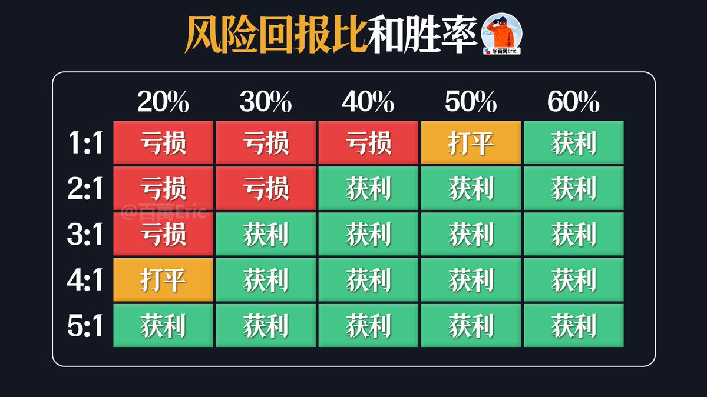
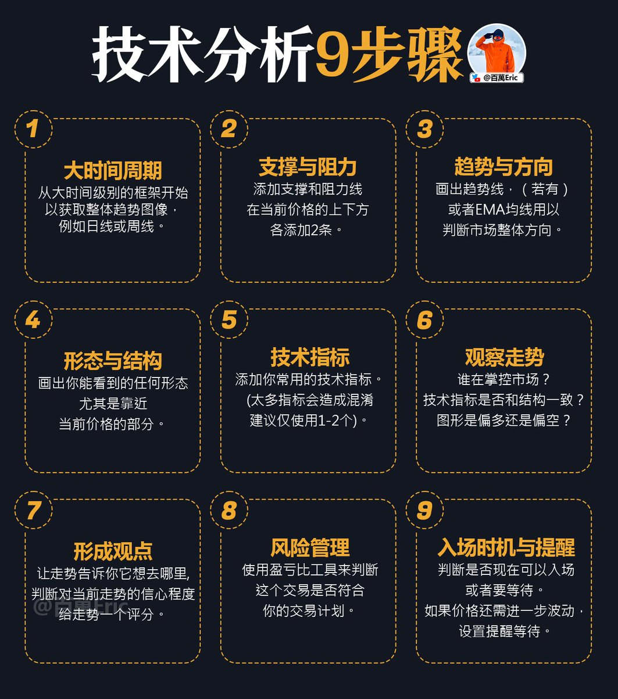
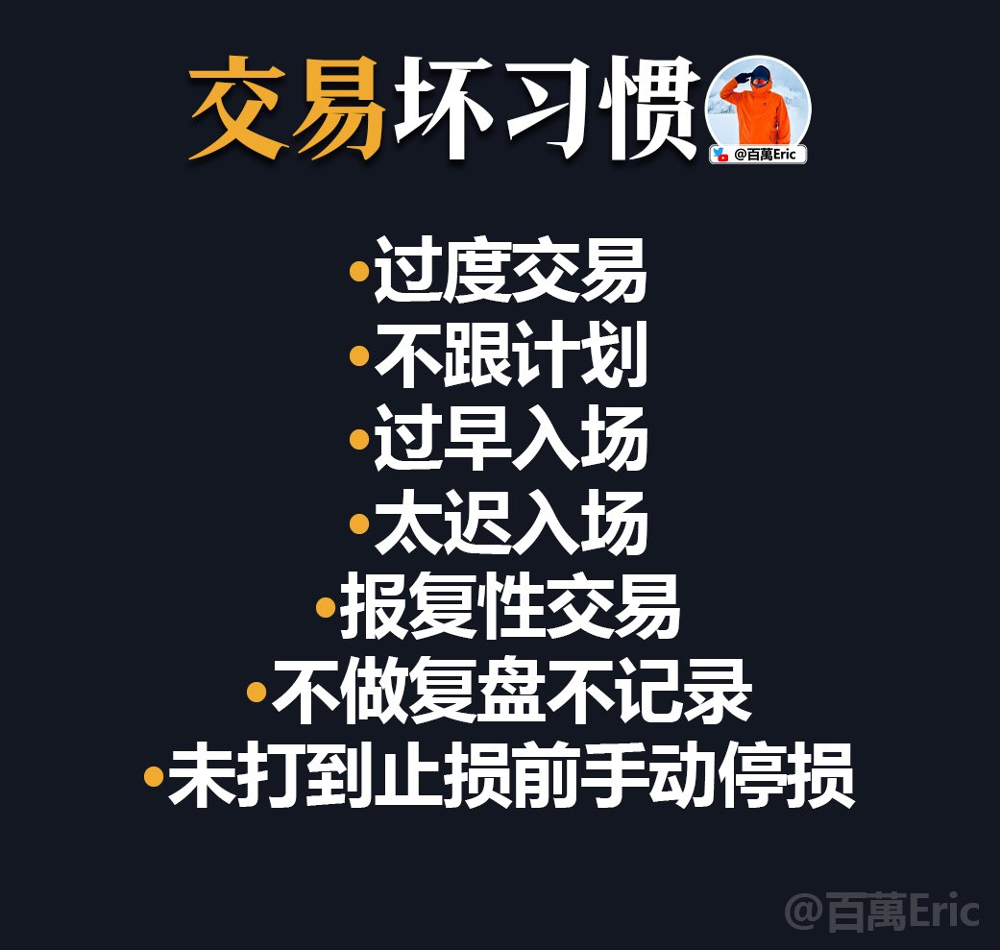
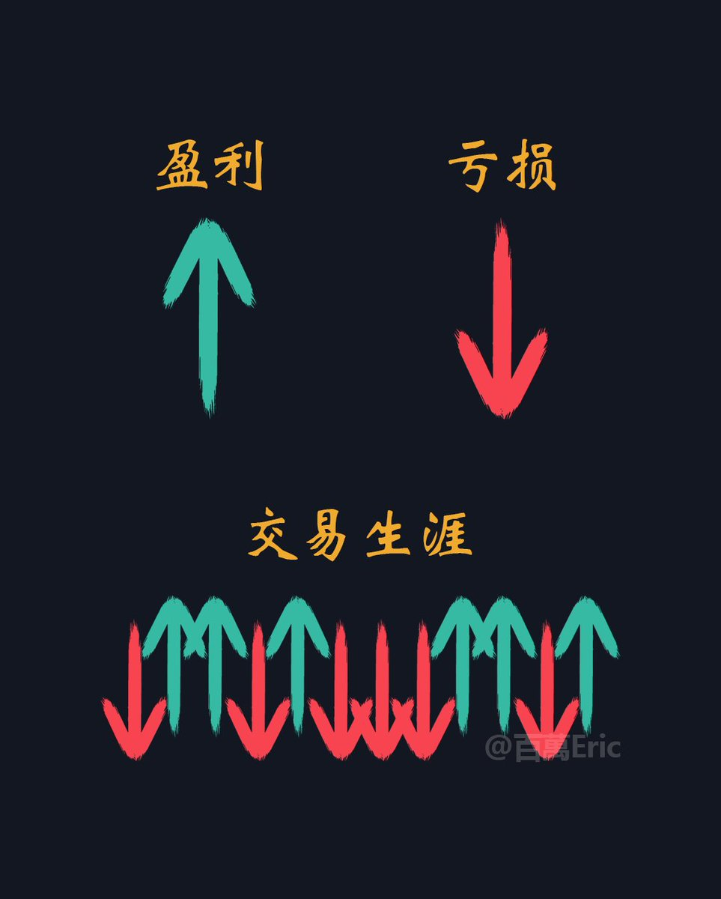
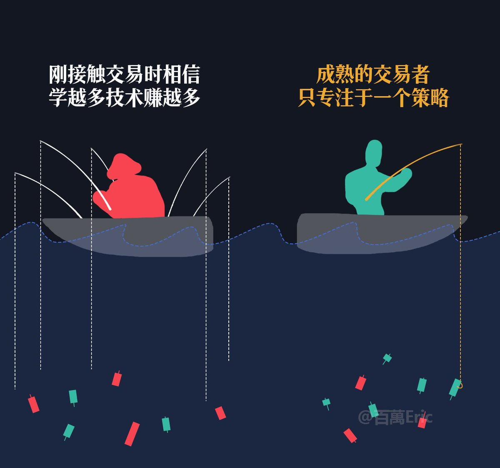

## 风险与盈利的判断链条

风险与盈利本质上是一体两面。

交易的正常流程应该是：先发现风险，再对风险进行归类，随后制定处理方式，最终在控制风险的基础上实现持续盈利。

这才是合格交易者的判断链条，而不是盯着K线红绿变色乱猜方向。

赌狗思维往往停留在表面：绿蜡烛就幻想起飞，红蜡烛就恐慌归零，满脑子想着怎么梭才能立刻赚钱。这样的操作，本质上只是把自己交给情绪和运气

---

## 市场预测的局限与误区

交易员视角：市场整体是不可预测的，趋势行情又没预测的必要。

委婉的说法： 预测的前提是建立在大量统计样本的数据上。人脑（尤其是前额叶）处理信息的能力有限，短时间内根本无法处理海量数据，更别说得出有统计优势的结论。

刻薄的说法：主观预测市场是非常业余的表现，分析有意义， 实盘交易意义不大。币圈那些连九年义务教育都没完成的“分析师”，每天找个刁钻角度限时限点预测涨跌，一副拳打利弗莫尔，脚踢索罗斯，一笔交易买地球的架势

---

## 盈亏比与胜率的关系

1:1 要求高胜率

2:1 胜率≥40%

3:1 胜率≥30%

4:1 胜率≥20%

5:1 基本稳赚

胜率撑不起来，就靠高盈亏比弥补；盈亏比越高，对胜率要求越低。

---

## 交易的关键在于下一步决策

单根K线左右不了全局，趋势也不会轻易终结。
真正决定你能走多远的，是你下一笔单子怎么做。

---

## 交易的核心是生存

交易里最难的不是赚钱，而是活下去。
保住本金才能谈未来，执行一致才能避免自毁，心态良好才能撑过周期。

---

## 交易格言
做对，赚钱。

做错，打损。

扛单，有病。

冲动，必亏。

乱加，必死。

摊平，意淫。

重仓，投胎。

频繁，自杀。

止损，保命。

执行，才赢。

---

## 结构与幅度

很多人看到短期涨幅大，就下意识认为行情很强，怕错过。但实战中，真正决定行情空间和延续性的，不是涨了多少，而是价格结构有没有完成切换。

结构一旦建立，多头才有延续的基础。否则哪怕一口气涨了20%、30%，也可能是从底部反弹、空头回补、流动性推动等多种短期力量构成，无法简单理解为趋势确立。

所以在判断行情强弱时，顺序一定要放对：先看结构有没有成立，再看幅度表现，不要本末倒置。

---

## 风险的本质

涨，不是风险；跌，也不是风险。

大阳线的快速拉升，不是风险；大阴线的无量下跌，也不是风险。

每一根K线背后，都是无数交易者的多空博弈，不论价格向上还是向下，都有人在赚钱。

涨跌只是市场的客观表达，它本身不会让你亏钱。

真正让你亏钱、让你承担风险的，是你在这些涨跌中做出的错误决策。脱离交易策略框架，用不能承受的资金去冒险，或者盲目、情绪化地下单。

这些行为不是不能赚钱，而是选择与概率为敌。长期下来，没有任何交易优势。

所以，真正的风险从来不是市场的涨跌，而是你自己。

---

## 交易的本质

技术分析的流程，不是机械地套模板，而是用一套从大到小的观察顺序，把市场局势拆解清楚。

先从大周期入手，建立宏观的价格框架，再标注当前价格附近的关键支撑和阻力。接着判断趋势方向，可以借助趋势线或均线，明确市场的主要运行倾向。

有了方向，还需要识别结构形态，尤其是靠近当前价格的区域，因为那是后续操作的主要战场。技术指标只作为补充，用于量化强弱或验证结构信号，避免过多干扰。

在观察走势时，要注意谁在主导市场，以及技术信号与结构的契合度，结合这些形成对行情延续可能性的判断。

最后，通过风险管理工具验证交易计划的可行性，并在价格进入关键区域前设置好预警。

整个过程像一张逐层缩放的地图，先定大框，再找路径，最后确认落点。

---

## 空仓

如果现在是空仓怎么办？

第一步不是急着进场，而是先用EMA均线组作为价格防线，这样无论你选择追多还是等回调，都能明确止损位置。

第二步，时间周期建议关注1小时和4小时，这两个周期既能看清结构节奏，又能避免被5分钟、15分钟的短线波动干扰。

第三步，等价格回踩EMA均线组并企稳，或者突破后回踩确认支撑时，再考虑逐步进场，这样盈亏比和胜率会更有保障。

这样做的好处是，不会因为焦急而在高位盲目追单，同时也能确保一旦行情反转，有清晰的退出机制。

说得更简单一点，只要你能找到止损就不存在踏空。踏空是分析师赚流量的话术。

---

## ABC模式

在技术分析里，我们经常用一些极简表达来降低彼此沟通的成本。

比如最经典的“ABC模式”：如果A出现并触发B条件，那么C大概率会发生。这样的表达就像地图上的直线，干净、简单、没有噪音。

可到了真实交易里，事情往往没那么直线。听起来很顺的ABC，一进场就可能变成A-B-扫损-D-E，然后才有可能到C。

为什么？因为这种模式只是分析框架，用来描述市场结构的逻辑，而不是一份可直接执行的交易计划。

真正决定一笔交易盈亏的，是第二步找到具有统计优势的下单点。

这一步不仅要满足技术条件，还要结合历史数据、盈亏比、胜率验证，甚至盘中波动的节奏去筛选时机。

问题是，这部分工作枯燥、耗时、需要计算（大部分人对数字不忙敏感，更讨厌数学）因此，现实中大多数人要么不具备这样的能力，要么本能地抗拒去做，所以才会在看分析时觉得简单，实盘操作时却屡屡碰壁。

最后，回到你的问题。从分析角度看，你的理解没错；但站在交易的角度，我需要等到具有统计优势的看涨数据站在我这边，那才是下单的信号。

---

## 止盈止损

加速上涨的标的，小额止盈，上调止损。

震荡上涨的标的，小额止盈，不调止损。

微利震荡的标的，不加仓位，不调止损。

浮亏状态的标的，不加仓位，不调止损。

---

## 交易的代价

很多交易者知道自己的坏习惯，却很少正视它们的代价。

过度交易，往往是情绪在驱动，而不是信号。

不跟计划，是把偶然当必然。

过早或过迟入场，本质上都是害怕错过机会。

报复性交易，则是试图用市场替自己“出气”。

不做复盘，就是放弃了从错误中提炼经验；提前手动止损，则是对自己的交易体系缺乏信任。

坏习惯不可怕，可怕的是在毫无察觉中一遍遍重复。等情绪被推到临界点，思考彻底停摆，最后一把梭哈“死了算了”

---

## 进步

不敢开单，不一定是退步，很多时候是进步，是尊重市场的表现。

每天的市场的波动，你可以找到100%的分析理由，但真正值得出手的机会，也许只有20%，甚至更少。

行情分析≠交易机会

等你真的意识到，大多数波动只是噪音，你会发现，减少出手频率反而赚了更多的钱

---

## 保持冷静

每一次做单前，我都会刻意提醒自己：保持中性，保持客观，不能因为欲望或情绪去解读市场。

---

## 学交易

很多人误以为“学交易”就是少做、等机会、忍情绪，这让这条路听起来像苦行僧式的生活

其实不是，真正的学，是构建一个可以复制、可以迭代、基于现实的交易系统。

不是靠直觉出手，而是靠结构驱动决策；不是靠状态强势，而是靠规则执行

---

## 心态

新手总是纠结这一笔赚不赚钱、准不准，心态也跟着起伏。

但真正能稳定的人，早就不再靠“每一笔对不对”来判断自己好不好—而是看：这一系列交易，最终有没有让账户净值稳步推高。

就像图里这些箭头，不是每根都能赚钱，但组合起来是正向累积的。

亏损可以有，连续亏损也正常，但关键是你能不能熬得住、守得稳，并在关键行情来时一击推进，吃出趋势。

---

## 风控

我的核心交易理念：不预测涨跌，只在交易系统内做高赔率博弈。

那既然市场不可预测，就得接受它随时会“抽风”，所以我唯一能做的，就是把风控做到极致。

每笔单子风险都控制在总资金的1%以内，以损定仓。

先算清楚风险，再谈赚钱。

这不是谦虚，是我能活到现在、还愿意长期留在牌桌上的唯一方式。

---

## 复杂的策略不一定赚钱

「复杂的策略不一定赚钱，骗人的逻辑一定要简单」。

“大道至简”这句话，如果脱离上下文，本质上是一种误导。

从“道理”层面看，交易确实不复杂。买低卖高、顺势而为、止损止盈、盈亏比大于1—这些逻辑人人都懂，听起来简单。

但从“执行”层面看，交易极其困难。真正该下单的时候你恐惧，真正该止损的时候你侥幸，真正连续止损后你就不敢进场了。

你以为自己缺的是技术，实际上你卡的是情绪、判断和一致性。

所以，交易从来不是“简单”，而是你必须把复杂的事，做到看起来很简单。

---

##

