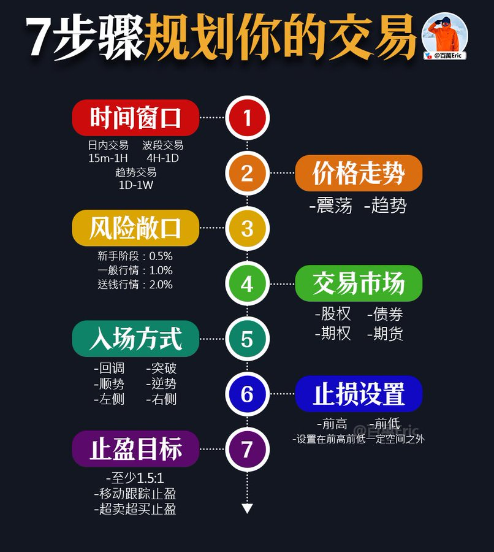
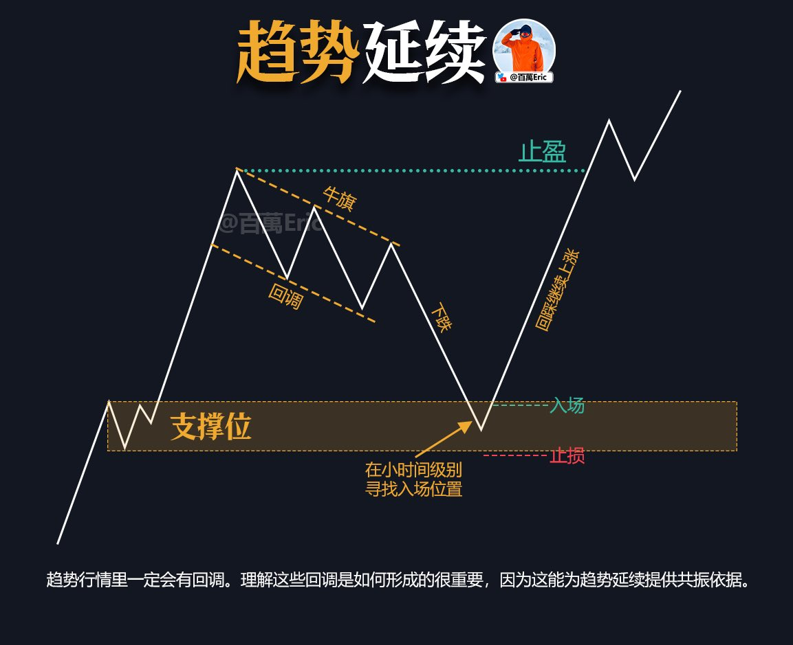
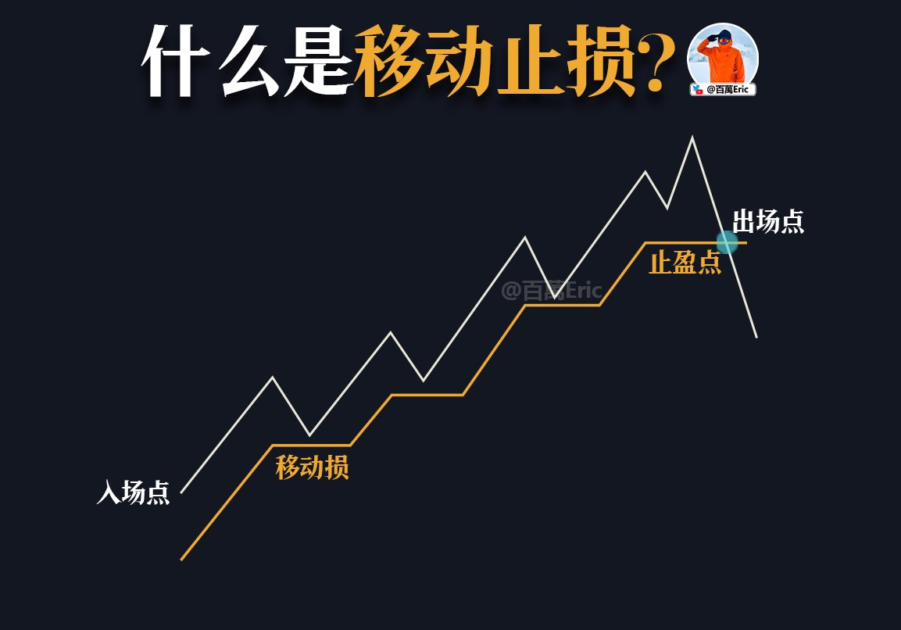
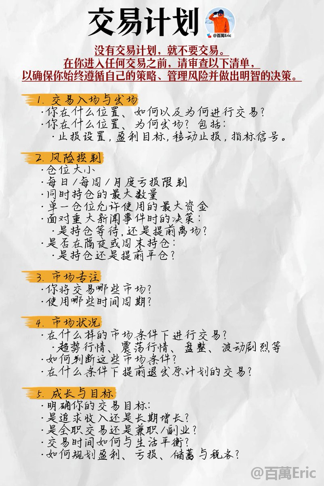
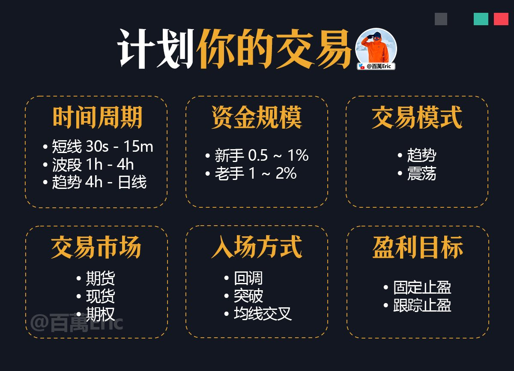
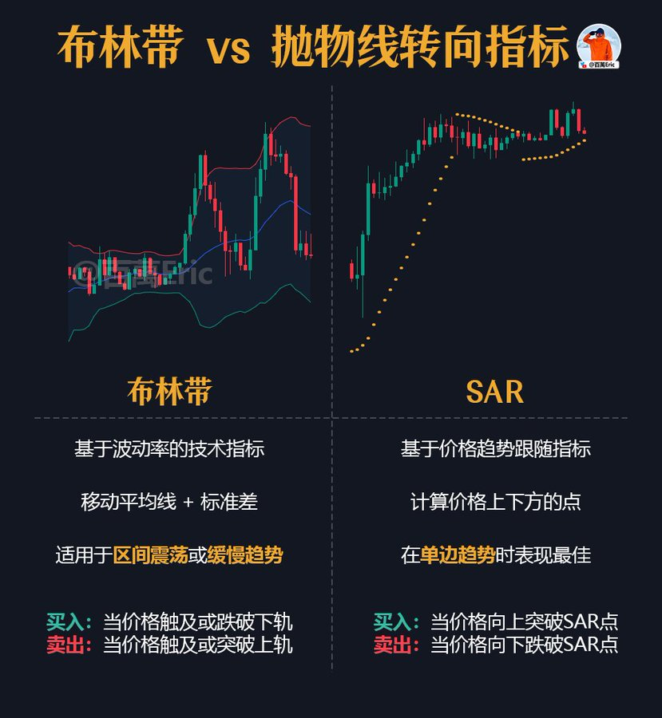
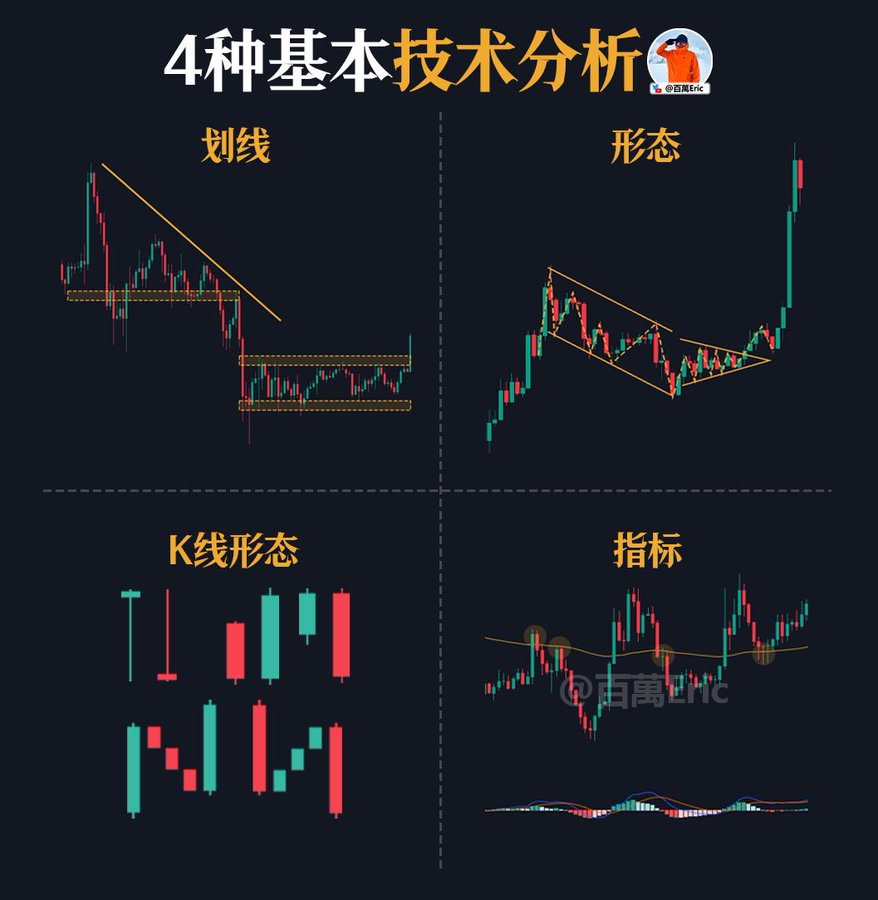
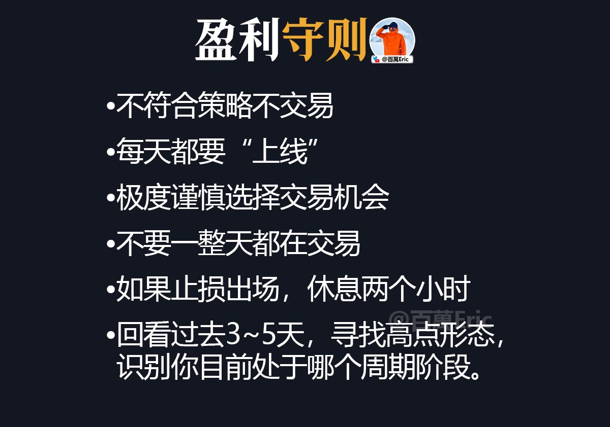

## 风险与盈利的判断链条

风险与盈利本质上是一体两面。

交易的正常流程应该是：先发现风险，再对风险进行归类，随后制定处理方式，最终在控制风险的基础上实现持续盈利。

这才是合格交易者的判断链条，而不是盯着K线红绿变色乱猜方向。

赌狗思维往往停留在表面：绿蜡烛就幻想起飞，红蜡烛就恐慌归零，满脑子想着怎么梭才能立刻赚钱。这样的操作，本质上只是把自己交给情绪和运气

---

## 市场预测的局限与误区

交易员视角：市场整体是不可预测的，趋势行情又没预测的必要。

委婉的说法： 预测的前提是建立在大量统计样本的数据上。人脑（尤其是前额叶）处理信息的能力有限，短时间内根本无法处理海量数据，更别说得出有统计优势的结论。

刻薄的说法：主观预测市场是非常业余的表现，分析有意义， 实盘交易意义不大。币圈那些连九年义务教育都没完成的“分析师”，每天找个刁钻角度限时限点预测涨跌，一副拳打利弗莫尔，脚踢索罗斯，一笔交易买地球的架势

---

## 盈亏比与胜率的关系

1:1 要求高胜率

2:1 胜率≥40%

3:1 胜率≥30%

4:1 胜率≥20%

5:1 基本稳赚

胜率撑不起来，就靠高盈亏比弥补；盈亏比越高，对胜率要求越低。

---

## 交易的关键在于下一步决策

单根K线左右不了全局，趋势也不会轻易终结。
真正决定你能走多远的，是你下一笔单子怎么做。

---

## 交易的核心是生存

交易里最难的不是赚钱，而是活下去。
保住本金才能谈未来，执行一致才能避免自毁，心态良好才能撑过周期。

---

## 交易格言
做对，赚钱。

做错，打损。

扛单，有病。

冲动，必亏。

乱加，必死。

摊平，意淫。

重仓，投胎。

频繁，自杀。

止损，保命。

执行，才赢。

---

## 结构与幅度

很多人看到短期涨幅大，就下意识认为行情很强，怕错过。但实战中，真正决定行情空间和延续性的，不是涨了多少，而是价格结构有没有完成切换。

结构一旦建立，多头才有延续的基础。否则哪怕一口气涨了20%、30%，也可能是从底部反弹、空头回补、流动性推动等多种短期力量构成，无法简单理解为趋势确立。

所以在判断行情强弱时，顺序一定要放对：先看结构有没有成立，再看幅度表现，不要本末倒置。

---

## 风险的本质

涨，不是风险；跌，也不是风险。

大阳线的快速拉升，不是风险；大阴线的无量下跌，也不是风险。

每一根K线背后，都是无数交易者的多空博弈，不论价格向上还是向下，都有人在赚钱。

涨跌只是市场的客观表达，它本身不会让你亏钱。

真正让你亏钱、让你承担风险的，是你在这些涨跌中做出的错误决策。脱离交易策略框架，用不能承受的资金去冒险，或者盲目、情绪化地下单。

这些行为不是不能赚钱，而是选择与概率为敌。长期下来，没有任何交易优势。

所以，真正的风险从来不是市场的涨跌，而是你自己。

---

## 交易的本质

技术分析的流程，不是机械地套模板，而是用一套从大到小的观察顺序，把市场局势拆解清楚。

先从大周期入手，建立宏观的价格框架，再标注当前价格附近的关键支撑和阻力。接着判断趋势方向，可以借助趋势线或均线，明确市场的主要运行倾向。

有了方向，还需要识别结构形态，尤其是靠近当前价格的区域，因为那是后续操作的主要战场。技术指标只作为补充，用于量化强弱或验证结构信号，避免过多干扰。

在观察走势时，要注意谁在主导市场，以及技术信号与结构的契合度，结合这些形成对行情延续可能性的判断。

最后，通过风险管理工具验证交易计划的可行性，并在价格进入关键区域前设置好预警。

整个过程像一张逐层缩放的地图，先定大框，再找路径，最后确认落点。

---

## 空仓

如果现在是空仓怎么办？

第一步不是急着进场，而是先用EMA均线组作为价格防线，这样无论你选择追多还是等回调，都能明确止损位置。

第二步，时间周期建议关注1小时和4小时，这两个周期既能看清结构节奏，又能避免被5分钟、15分钟的短线波动干扰。

第三步，等价格回踩EMA均线组并企稳，或者突破后回踩确认支撑时，再考虑逐步进场，这样盈亏比和胜率会更有保障。

这样做的好处是，不会因为焦急而在高位盲目追单，同时也能确保一旦行情反转，有清晰的退出机制。

说得更简单一点，只要你能找到止损就不存在踏空。踏空是分析师赚流量的话术。

---

## ABC模式

在技术分析里，我们经常用一些极简表达来降低彼此沟通的成本。

比如最经典的“ABC模式”：如果A出现并触发B条件，那么C大概率会发生。这样的表达就像地图上的直线，干净、简单、没有噪音。

可到了真实交易里，事情往往没那么直线。听起来很顺的ABC，一进场就可能变成A-B-扫损-D-E，然后才有可能到C。

为什么？因为这种模式只是分析框架，用来描述市场结构的逻辑，而不是一份可直接执行的交易计划。

真正决定一笔交易盈亏的，是第二步找到具有统计优势的下单点。

这一步不仅要满足技术条件，还要结合历史数据、盈亏比、胜率验证，甚至盘中波动的节奏去筛选时机。

问题是，这部分工作枯燥、耗时、需要计算（大部分人对数字不忙敏感，更讨厌数学）因此，现实中大多数人要么不具备这样的能力，要么本能地抗拒去做，所以才会在看分析时觉得简单，实盘操作时却屡屡碰壁。

最后，回到你的问题。从分析角度看，你的理解没错；但站在交易的角度，我需要等到具有统计优势的看涨数据站在我这边，那才是下单的信号。

---

## 止盈止损

加速上涨的标的，小额止盈，上调止损。

震荡上涨的标的，小额止盈，不调止损。

微利震荡的标的，不加仓位，不调止损。

浮亏状态的标的，不加仓位，不调止损。

---

## 交易的代价

很多交易者知道自己的坏习惯，却很少正视它们的代价。

过度交易，往往是情绪在驱动，而不是信号。

不跟计划，是把偶然当必然。

过早或过迟入场，本质上都是害怕错过机会。

报复性交易，则是试图用市场替自己“出气”。

不做复盘，就是放弃了从错误中提炼经验；提前手动止损，则是对自己的交易体系缺乏信任。

坏习惯不可怕，可怕的是在毫无察觉中一遍遍重复。等情绪被推到临界点，思考彻底停摆，最后一把梭哈“死了算了”

---

## 进步

不敢开单，不一定是退步，很多时候是进步，是尊重市场的表现。

每天的市场的波动，你可以找到100%的分析理由，但真正值得出手的机会，也许只有20%，甚至更少。

行情分析≠交易机会

等你真的意识到，大多数波动只是噪音，你会发现，减少出手频率反而赚了更多的钱

---

## 保持冷静

每一次做单前，我都会刻意提醒自己：保持中性，保持客观，不能因为欲望或情绪去解读市场。

---

## 学交易

很多人误以为“学交易”就是少做、等机会、忍情绪，这让这条路听起来像苦行僧式的生活

其实不是，真正的学，是构建一个可以复制、可以迭代、基于现实的交易系统。

不是靠直觉出手，而是靠结构驱动决策；不是靠状态强势，而是靠规则执行

---

## 心态

新手总是纠结这一笔赚不赚钱、准不准，心态也跟着起伏。

但真正能稳定的人，早就不再靠“每一笔对不对”来判断自己好不好—而是看：这一系列交易，最终有没有让账户净值稳步推高。

就像图里这些箭头，不是每根都能赚钱，但组合起来是正向累积的。

亏损可以有，连续亏损也正常，但关键是你能不能熬得住、守得稳，并在关键行情来时一击推进，吃出趋势。

---

## 风控

我的核心交易理念：不预测涨跌，只在交易系统内做高赔率博弈。

那既然市场不可预测，就得接受它随时会“抽风”，所以我唯一能做的，就是把风控做到极致。

每笔单子风险都控制在总资金的1%以内，以损定仓。

先算清楚风险，再谈赚钱。

这不是谦虚，是我能活到现在、还愿意长期留在牌桌上的唯一方式。

---

## 复杂的策略不一定赚钱

「复杂的策略不一定赚钱，骗人的逻辑一定要简单」。

“大道至简”这句话，如果脱离上下文，本质上是一种误导。

从“道理”层面看，交易确实不复杂。买低卖高、顺势而为、止损止盈、盈亏比大于1—这些逻辑人人都懂，听起来简单。

但从“执行”层面看，交易极其困难。真正该下单的时候你恐惧，真正该止损的时候你侥幸，真正连续止损后你就不敢进场了。

你以为自己缺的是技术，实际上你卡的是情绪、判断和一致性。

所以，交易从来不是“简单”，而是你必须把复杂的事，做到看起来很简单。

---

## 结构与概率 

价格走势并不是完全随机跳动，而是由结构环环相扣构成的。

比如这张图，从上升楔形到假突破，再到支撑跌破、回测阻力、最后确认下行，这就是一个完整的走势演化链条。
其中的关键有两点：

第一，支撑和阻力的转换。一旦跌破，后续回测往往会变成反向压力。

第二，形态和位置的共振。楔形、头肩顶本身只是形态，真正决定后续方向的，是它们与关键支撑阻力的配合。

换句话说，研究走势结构的价值，不在于死记某个形态，而在于读懂：支撑和阻力是否被突破，以及回测是否确认。这才是交易里真正能转化为胜率的关键。

---

## 交易的七个步骤  

规划一笔交易，首先要明确交易的时间窗口。短线日内，波段，还是趋势，周期决定了持仓时长和容忍的波动幅度。

接着判断价格所处的环境，是震荡还是趋势。震荡区间适合低吸高抛，趋势环境则要顺势而为。

第三步是确定风险敞口。新手阶段仓位别超过总资金的0.5%，普通行情1%，极端送钱行情才会放大到2%。

第四步是确认交易的市场品种，不同资产波动率和流动性差别巨大，股、债、期货、期权不能混为一谈。

第五步是决定入场方式。常见有回调介入、突破跟进、左侧预判或右侧确认，背后考验的是你对概率与成本的取舍。

第六步是止损。止损不只是一个数字，而是位置逻辑，通常设在前高或前低之外，确保一旦被打掉，就是走势结构彻底被破坏。

最后是止盈。至少要保证盈亏比在1.5:1以上，行情强势时可以用移动止盈或超买超卖指标锁定利润。

这七步组合起来，才是一笔完整、可复盘、可复制的交易。

---

## 交易的核心要素

看得远，拿得住，做得成。 

对应：眼光、心态、行动。

想要在投机市场长期盈利：

三者俱备，逆天改命。 

占其两项，稳步盈利。 

仅得其一，胜负难定。

---

## 趋势的起点

真正的趋势行情，往往是在震荡中悄然酝酿。

价格通过一段时间内高低点持续抬高（多头）或不断降低（空头），并反复测试关键结构位，逐步打破多空平衡。

最后那根大阳线或大阴线，只是结果而已。

也就是说，真正的起点，其实早就在那段你嫌烦的震荡里了。

---

## 趋势的起点

趋势=上涨+回调+再加速。

趋势延续的核心在于：市场从来不会一口气走完，而是不断通过回调来换手。

真正的买点，往往出现在别人犹豫、甚至怀疑趋势是否还能走下去的时刻。

你要做的不是预测回调什么时候结束，而是在关键支撑位出现止跌信号时果断上车，同时设好止损。

这样你既能抓住趋势延续，又能在错误时付出有限代价。

---

## 交易与分析的区别

分析是分析，交易是交易，两者不是一回事。

分析本身并不一定要求你立刻去下单，它更多是一个独立的筛选过程，让你看清市场机会。

与之相对应的，交易则是在分析基础上做出的实际行动。

但能不能执行这笔交易，还要看你对风险的理解、你的时间安排、你的性格特点以及你的整体交易策略。

有时候机会是客观存在的，但基于这些个人因素，你可能会选择不去执行它。

---

## 止损的意义

被扫损并大多数时候都源于开单逻辑本身存在问题。

常见的几种情况无非是以下几点：

一，止损设置过小。想做趋势行情，却依旧用短线思路的止损，一旦波动加大就轻易被扫出局。

二，仓位过大。期望入场后价格立刻远离成本线，抓住所谓的“起爆点”，结果反而让自己在浮亏时承受过大的心理压力。

三，基本功不扎实。错了一次后，心态失衡，不敢继续执行既定策略，陷入恶性循环。

无论被扫损的原因是什么，本质上都只是交易过程中的一个细节。但你有一点值得肯定：你单单设置止损，已经让你站在了交易者的合格门槛上。

大多数人之所以亏到无法翻身，不是因为止损打得多，而是因为根本不设止损，任由亏损无限放大，最后连翻身的机会都没有。

---

## 移动止损

移动止损是我最喜欢的交易手法之一。

当价格不断创新高时，止损跟随上移，把已经到手的利润逐步锁定。

这样做的好处在于：趋势延续时，你不会过早出场，能够跟上更大的行情。

而一旦价格反转，移动止损会自动触发，守住已经积累的盈利。

常用的移动止损方法有两类：

价格形态：稍显主观，但一旦行情反转，能最大程度保住利润；
EMA20/50:客观固定，能有效避免被短期波动插针扫掉。

两者各有优缺点，都值得使用，关键是通过实战找到最适合自己的方式。

---

## 交易的捷径

《屈身守分，以待天时》。

在投机市场里想获得成功，唯一的捷径，就是不走捷径。

应该以百单、千单为单位，去设计和执行刻意训练的流程。

精确计算仓位，机械化执行，打好每一笔交易。

赚了，就是对逻辑的验证；亏了，就是经验的积累。

只要赶上一轮行情，就有机会实现阶级的跨越。

---

## 周期分析

大周期把握整体方向，小周期提供精确的入场点。

以月线为例：它由大约30根日线组成。月线的开盘价，就是这30天里第一天的开盘；最高价和最低价，分别是这30天里出现的最高点和最低点；收盘价，就是最后一天的收盘。

对交易者来说，这一点至关重要。小周期能展现波动的细节，但容易陷入噪音（追涨杀跌）。大周期能把握整体方向，却缺少精确的入场点。

所以，做交易不能只盯一个周期。

先用大周期判断趋势，再用小周期寻找入场时机，才能同时兼顾方向与执行，形成完整的操作逻辑。

---

## 交易原则

以统计优势为矛，以风险管理为盾。

不预测下一根K线，不因单笔盈亏定输赢.

机械执行计划，在市场中不断进行正期望的博弈。

---

## 交易计划

在市场里，没有交易计划就贸然下单，几乎等于赌博。一个合格的计划，至少要覆盖五个方面：

第一，入场与出场：你要明确什么位置进场，什么条件出场，止损、止盈和移动止损都要写清楚。

第二，风险控制：包括仓位大小、单笔风险上限、总持仓数量，以及面对重大新闻时如何处理。

第三，保持专注：确定你要交易的市场与周期，避免见什么都想做。（趋势能赚钱，震荡也能赚钱。但没有人能做到每一笔都赚）

第四，市场状况：清楚自己在哪种行情条件下出手，趋势、震荡还是波动剧烈的环境。

第五，成长与目标。交易是追求收入，还是长期增值？是全职还是副业？如何在盈利、亏损和储蓄之间找到平衡？

换句话说，一个完整的交易计划，不是喊口号，而是要能回答：你凭什么进场？怎么控制风险？目标是什么？

---

## 交易机会

持续稳定赚钱的前提，是标的本身“走得有规律”。

什么叫有规律？
尊重价格结构、尊重信号、尊重均线，跌有逻辑、涨有预期。

反之，像那种一波流、频繁插针、均线乱穿的币，赚钱了也是凭运气。

---

## 交易框架

时间周期决定你看的是什么。

风险管理决定你扛得住什么。

交易模式决定你适合做什么。

入场逻辑决定你的盈亏比。

止盈止损决定你如何生存。

以上5件事，决定一个交易者的命运。

---

## 六个核心维度

系统性提升交易能力，绕不开六个核心维度：

一、时间周期
你做的周期决定你能参与的机会类型和节奏快慢。
•短线（30秒~15分钟）：适合高频波动，考验执行力
•波段（1小时~4小时）：适合日内或隔夜操作，兼顾效率与稳定
•趋势（4小时~日线）：侧重节奏与结构，适合更长持仓周期

二、资金规模
风险控制的根基，直接决定容错空间。
•     刚开始建议每笔控制在总资金的0.5%~1%风险
•熟练之后可逐步上调到1%~2%，但必须配合高执行力和清晰策略

三、交易模式
交易模式决定你专注哪类行情。
•趋势策略：顺势操作，专注动能爆发
•震荡策略：反向操作，寻找高赔率反转

四、交易市场
不同市场对节奏、工具和策略要求不同。
•期货适合放大杠杆、短期套利
•现货适合低频持仓、趋势交易
•期权适合结构化风险管理或特殊策略

五、入场方式
入场逻辑必须明确，不依赖模糊判断。
•回调进场：风险低，但确认慢
•突破进场：确认快，但容错低
•均线型：适合系统化、多样化回测的人

六、盈利目标
提前规划出场方式，是避免情绪干扰的必要手段。
•固定止盈：适合计划性强、规则化交易
•跟踪止盈：适合持有趋势单，追求波段收益

---

## 技术指标对比

这张图对比了两种常见的技术指标：布林带和SAR。

它们的逻辑完全不同，适用场景也几乎相反。用错节奏，很容易反着做单。

布林带：逆势思维，适合震荡行情

它围绕价格波动构建“震荡区间”，上下轨不是趋势确认，而是过度波动的提醒。

价格靠近上轨，不是追多信号，而是高位警惕；贴近下轨，也更可能是超跌回归。

适合横盘震荡中高抛低吸，但在趋势行情中，极容易逆势被套。

SAR：顺势思维，适合趋势行情

SAR像是一条不断调整的“假想止损线”，只要价格突破点位，就视为趋势转向。

它不预测顶部或底部，但一旦趋势展开，能稳稳跟住方向。

问题是，震荡市里经常被来回扫损，容易失去节奏感。

怎么选？关键看行情节奏

横盘震荡、波动反复 → 用布林带，做“回归”

趋势延续、方向明确 → 用SAR，跟“突破”

但最关键的，不在指标，而在你自己。

别一边想用SAR吃趋势的钱，一边又眼馋布林带里的震荡利润。

这种贪多的操作，最后往往是两边都挨打。

交易的核心从来不是“用更多”，而是“打得准”。选一套适合自己资金、节奏、风控能力的策略，打熟打透，反复做，

哪怕就这一套，也足以赚到很多钱。

---

## 认知入口

技术分析的四种基本派别，背后的核心思路可以归为四类“认知入口”：

1.划线：空间与节奏的界定工具，强调“趋势线、区间、通道”等可视化结构，用来判断方向、节奏与拐点位置。它关注的是价格的“运行轨道”，适合趋势型策略建立大框架。

2.形态：价格行为的结构剧本以头肩、双顶、杯柄等形态识别市场情绪的演进过程，目的是判断“结构性拐点”，强调价格行为的模式化演绎，适合反转与突破类策略。

3.K线：市场短期情绪的压缩片段，单根或组合K线用于捕捉“微观搏杀的结果”，如锤子线、吞没形态、十字星等，短线节奏把握用得最多，但需结合上下文解读，不能单用。

4.指标：数据平滑与量化提取，属于“衍生型判断”，把价格或成交量做加工处理后形成的辅助参考，优点是清晰客观，缺点是延迟或钝化。适合趋势跟随或背离捕捉。

最忌四种混杂判断、信号打架。

---

## 交易守则

真正能长期留在市场上的人，不靠每一单的胜率，而靠一套可执行、可恢复、可持续的行为框架。

图中这些“守则”，不是行为建议，而是“保命指南”。

第一层，是策略边界。所有交易必须源自清晰策略，否则不入场。执行前不合逻辑，执行后容易后悔。

第二层，是节奏控制。每日复盘，非交易日也应维持观察力；限制交易时长，是为了防止注意力稀释后做出情绪交易。

第三层，止损后的休息，不是缓解情绪，而是切断“连续决策”带来的惯性冲动（情绪化开单）；而回看3至5天，是重新找回行情的周期框架，避免被一时走势带节奏。

真正的高手，永远处于“下一次可以重新出手”的状态。

交易不是打满每一枪，而是保住子弹、挑好目标、选好时间。

---

##

理性交易：审慎建仓 → 小幅止盈 → 上调止损 → 择位加仓 → 回归止盈

赌徒交易：听风是雨 → 模糊下注 → 情绪跟盘 → 怨天尤人 → 重复循环

交易不容易，谁都曾在情绪里打过转。但只要你开始记录、复盘、用逻辑替代冲动，那就是走在越来越理性的路上。

---

##

