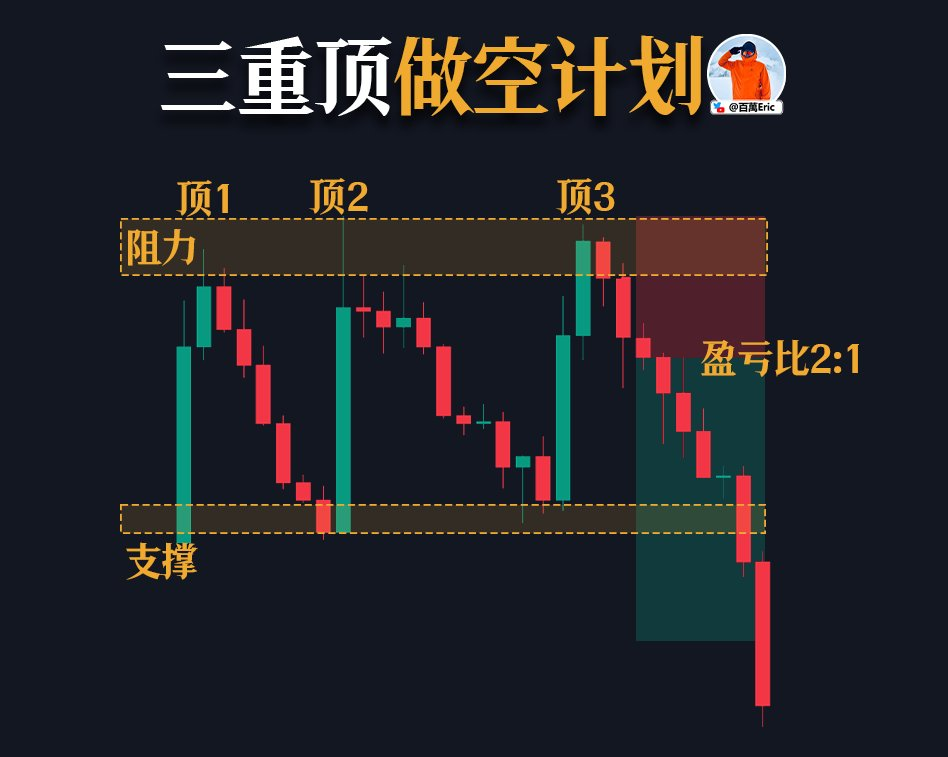
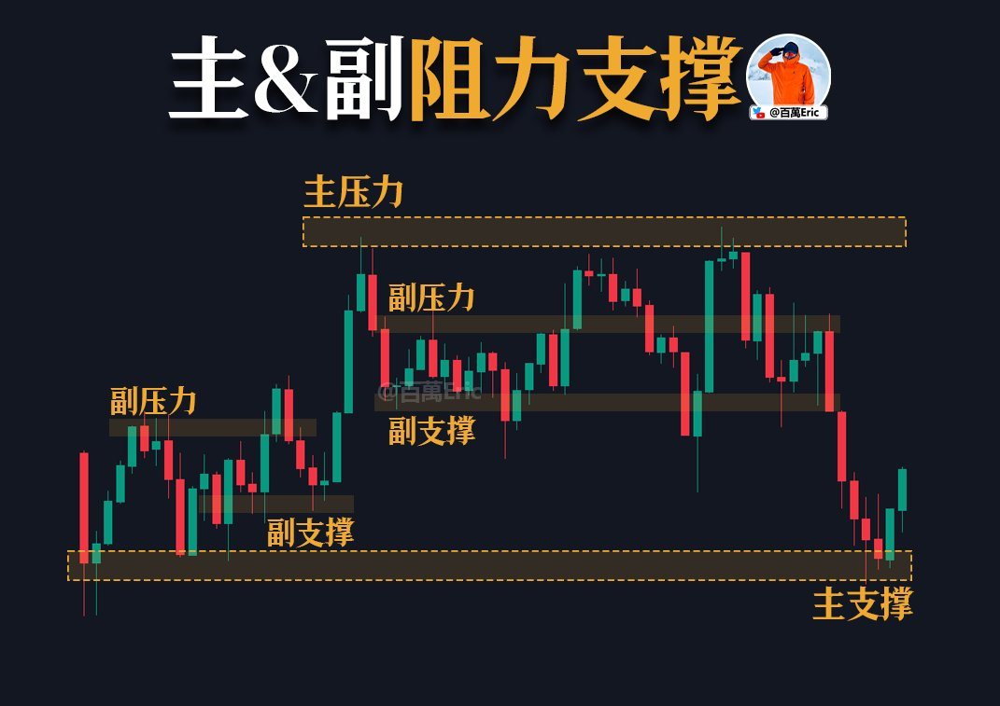
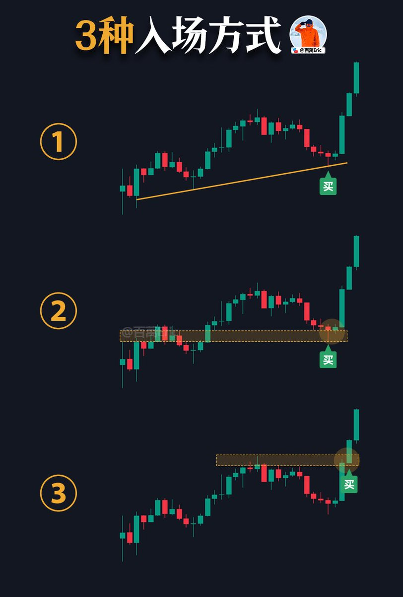
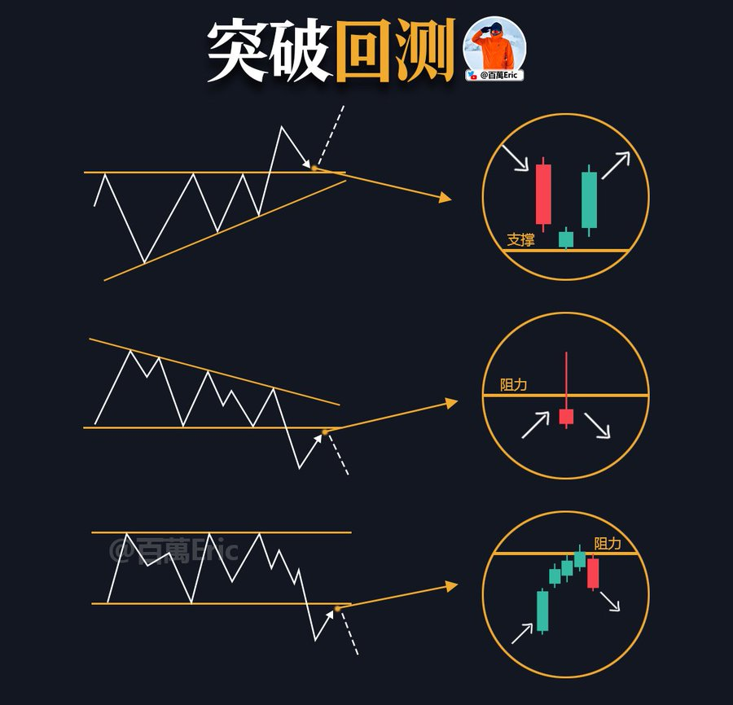
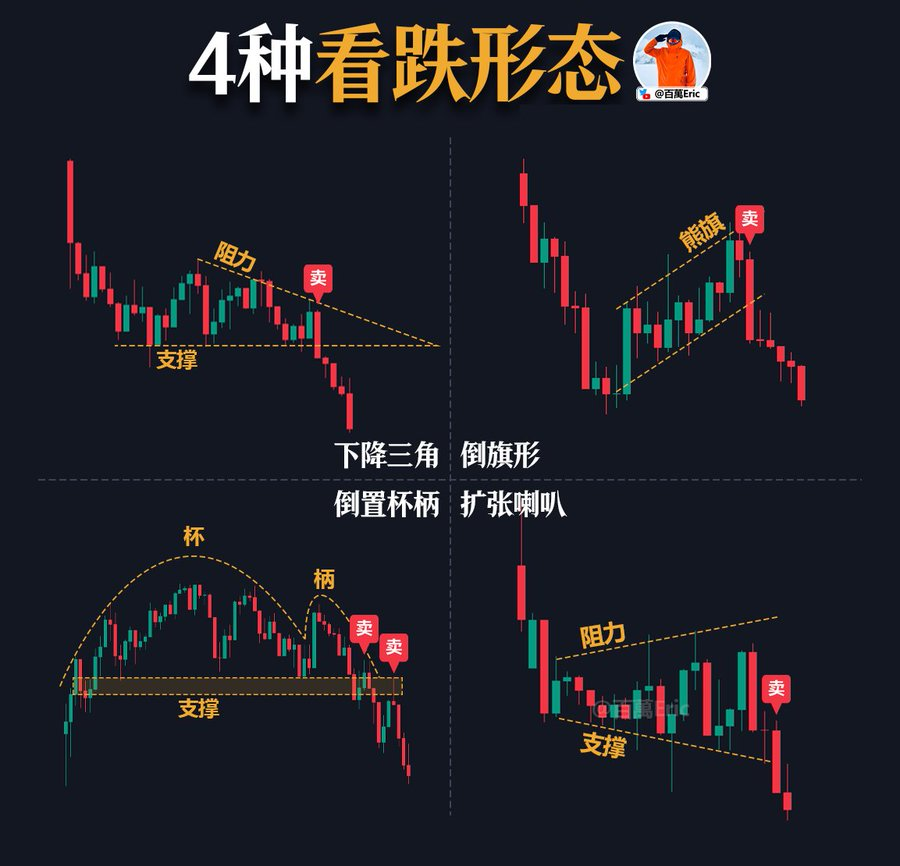
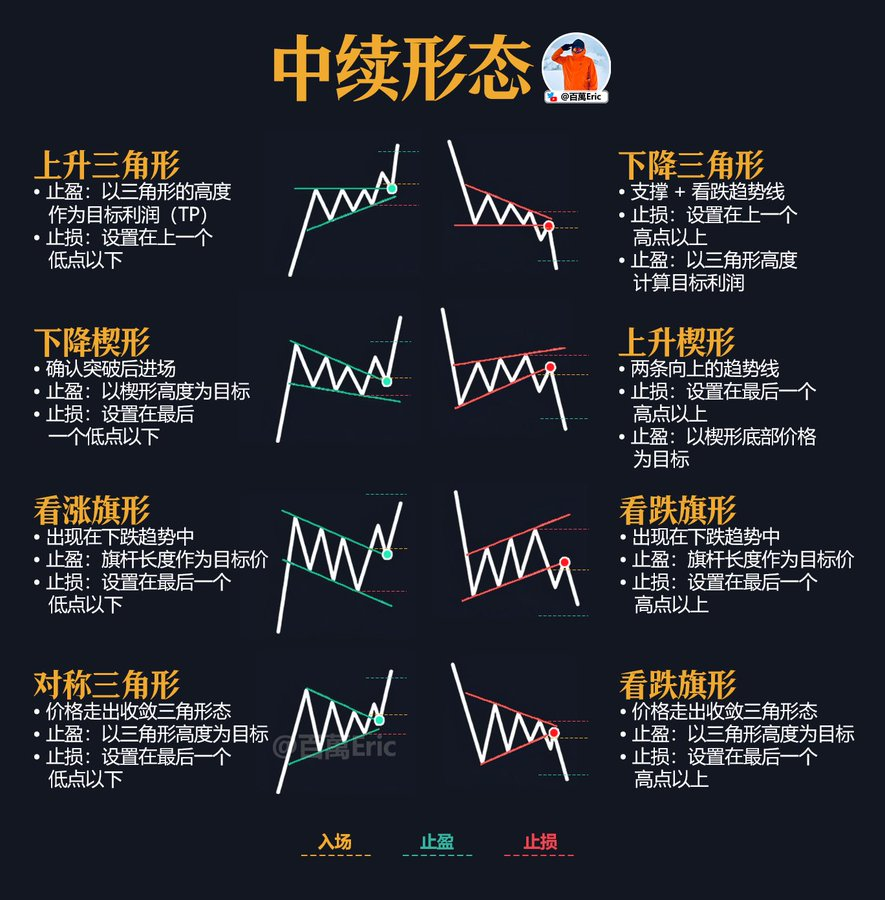
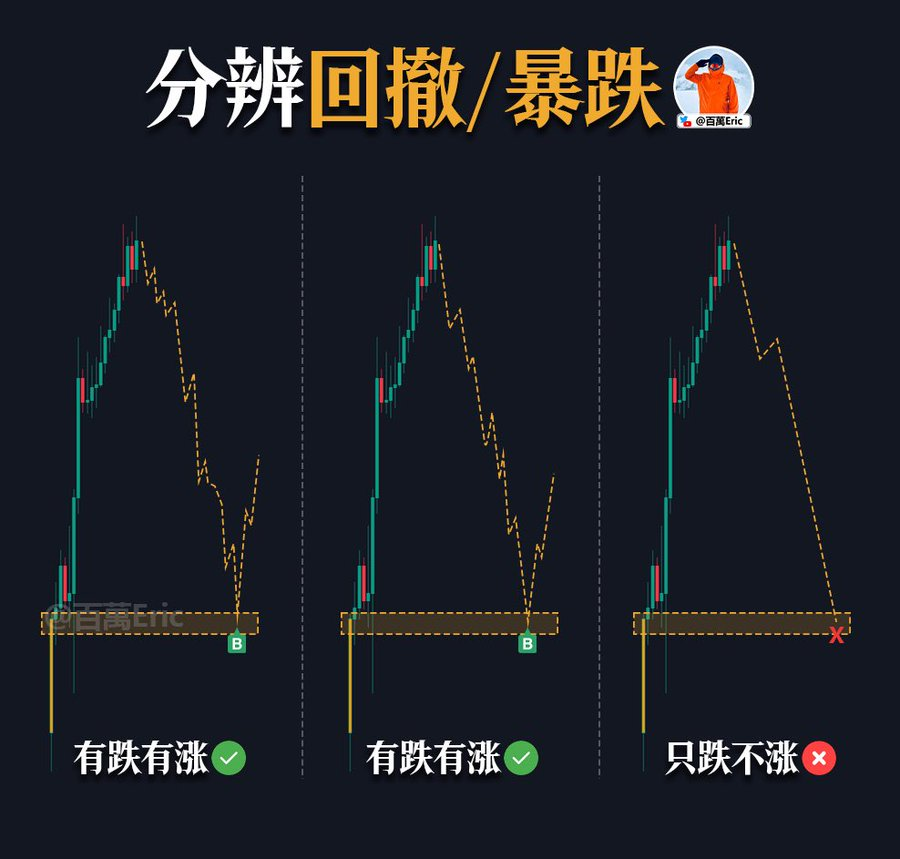

## 价格行为

价格行为的核心，在于观察多空力量在关键位置的表现。

图中多次出现长下影，说明每次价格下探到支撑区，买方都会在收盘前重新推高，把关键位置守了下来。

这其实反映了市场的真实博弈：支撑不是一条线，而是买盘反复介入、不断验证的区域。影线，就是买方力量的痕迹。

所以，判断价格行为，要看支撑是否被反复守住，买方是否在关键时刻积极介入。若答案成立，这个区域就具备参考价值。

---

## 反转K线形态

反转K线形态的价值，在于它们往往出现在关键位置，提示市场可能酝酿趋势转折。

例如，“阴吞没”常见于高位，说明卖方力量突然占优；而“锤子线”和“早晨之星”多出现在支撑区域，体现买盘在低位重新取得主动。

这些形态真正的意义，不在于单根K线本身，而在于结合位置和趋势去解读。

当它们叠加在关键阻力或支撑附近时，就从普通形态升级为有效信号。

最终，反转形态既是市场情绪的写照，也是交易计划中重要的入场与止损依据。

---

## 三重顶形态

三重顶是典型的顶部反转形态。价格在同一区域连续三次遇阻，说明上方阻力有效，同时也意味着买盘力量在逐渐减弱。

图中可以看到，阻力区反复压制，第三次冲高失败后价格回落，形态得到验证。

实盘操作时，入场点通常选择在第三次回落确认之际。止损要放在阻力区上方，以防假突破。

目标位则看形态下沿支撑，盈亏比往往能做到2:1甚至更好。

这种形态的价值，不在于“恰好三次高点”，而在于阻力反复确认，让进场与止损都有清晰的边界。
也就是说简单、傻瓜，止损清晰的交易机会。

---

## 支撑阻力的区别

在价格波动中，支撑与阻力并不是同等重要的。

主支撑和主阻力，往往来自更高周期或者大范围盘整区间的边界，它们对趋势的走向有决定性作用。

副支撑和副阻力，则更多出现在中途波动里，价格可能在其中多次反复，但一旦触及主级别，往往才会引发更强烈的趋势延续或反转。

从使用上看，主支撑和阻力是整体仓位管理的依据，决定交易的方向选择。副支撑和阻力则帮助优化进出场点位，提高盈亏比和交易节奏。

换句话说，主是骨架，副是细节，二者缺一不可。

---

## 支撑阻力互换

支撑阻力是交易里最基本的概念，但它不只是画一条水平线，而是在不同维度都有体现。

趋势线支撑，看的就是斜率。价格每次回踩趋势线都能稳住，就说明惯性还在，多头继续跟进。

均线支撑更像是动态的成本线，跟随价格波动。当价格回踩均线，往往就是买卖双方的分界。

支撑阻力互换，则是最直观的标记：阻力被突破，再回踩站稳，这里就变成了新的支撑。

这三种看似不同，其实是互补的。趋势线和均线提供节奏，支撑阻力互换明确关口，把它们结合起来，市场结构就更清晰。

---

## 等待回测

假突破是市场里最常见的陷阱之一。

价格冲破关键阻力，看起来要起飞，但很快掉头，追高的人瞬间被套。

我的习惯是，不会在第一根突破K线就进场，而是等回测确认。真正的突破，往往会（至少）回踩一次，把阻力变成新的支撑。支撑能守住，突破才算成立。

这样做的好处是，能避开绝大多数假突破。缺点也很现实：机会少了，有时候行情直接起飞，你只能看着。但这就是取舍。

所以，等待回测不是追求完美，而是为了更高的确定性。交易的关键，从来不是抓全，而是尽量少掉坑。

---

## 长下影线

长下影线，往往意味着一次下探失败。

空头把价格压到支撑下方，结果买盘立刻进来，把价格拉回去。影线本身，就是买方力量的痕迹。

更有意义的是，如果长下影不断在同一区域出现，那就不是偶然，而是稳定买盘在守。价格多次试探，却始终收不在支撑下方，这就是支撑被验证。

实盘里，看长下影要注意几点：

第一，它必须叠加在关键位置，单独一根没意义。

第二，看收盘价，而不是最低点。

第三，哪怕满足前两点，也只是低风险提示，不是稳赢信号，止损还是要放在影线低点之下。

说得更简单一点，长下影线反映的是一次多空力量的转换。读懂它，才能在市场恐慌中抓住那些相对安全的机会

---

## 斐波那契回调

斐波那契回调配合趋势，是一个挺实用的切入方法。

思路很简单：确定行情在走趋势，就别追在高点，而是等它回调，看关键比例位能不能撑住。

就拿图里的例子来说，价格在高位遇阻后往下走，刚好回到50%附近。重点不是数字有多神奇，而是它真的在这个位置企稳，把之前的阻力换成了支撑。

这个互换一旦确认，就给了一个低风险的上车机会。

具体要注意三点：

第一，前提是趋势方向要明确。没趋势的时候谈回调，更多是找死，不是找机会。

第二，别死盯比例。0.382、0.5、0.618 都只是参考，真正管用的是价格在那个位置的表现，能不能走出支撑阻力互换。

第三，止损一定要带。常见做法是放在0.618或者前低下方，一旦跌破，支撑就失效了，该走就走，别犹豫。

当然，不得不再次强调，斐波那契并不是预测未来的什么“神奇工具”，它只是帮你在趋势里挑出那些更顺手、更安全的切入点。

---

## 双顶

双顶之所以管用，是因为它反映了市场在高位的力量对比。

第一次冲顶没上去，说明压力在。第二次再冲还是没能突破，基本可以判断多头在高位的力量逐渐衰竭。。

做法上有几个关键：

先看颈线，只有跌破颈线才算真的双顶。跌穿那一刻，市场就从偏多彻底转为空。

然后看回测，通常跌破以后会反抽一下确认，完成支阻呼唤，这就是空单最舒服的切入点。

止损就很简单，放在第二顶上方或者跌破反弹测试区域，一旦被突破，说明形态不成立，得马上撤。

---

## 回调比例

入场没有唯一正确的点位，不同的回调深度，就是不同的选择。

38.2 的回调，适合想要提前上车的人。趋势强的时候，价格可能就只给这么浅的机会。不过止损很近，容易被洗掉。

61.8 是最常见的入场点，基本对应前一波走势的平衡区。盈亏比合理，也不至于太容易被震出。

78.6 更保守一些，等市场回得更深，确认支撑后再进，胜率高，但有时机会直接过去了。

88.6 就是极限低吸，通常要配合强支撑用。一旦错判，止损基本要设在113附近，亏损幅度会很大。

所以这些数字不是魔法，而是不同的思路。你想快，就浅一点；你要稳，就得多等一会。

关键是结合趋势背景，挑一个最合理的，而不是迷信参数。

---

## 支撑阻力

市场无论是上涨还是下跌，都会在一些区域停下来反复博弈。

支撑阻力，就是这样被市场的集体行为刻画出来的。

最简单的找法，寻找大时间级别价格形态的高低点。去看哪里出现过最多的互动——反复被压制、反复被拉起，这些地方就是关键的支撑和阻力。

它们的重要性，在于能提供两个最直接的参考：

第一，价格接近时，你可以提前计划，支撑附近考虑低吸，阻力附近考虑减仓或做空。

第二，一旦被有效突破，原本的阻力会变成新的支撑，反之亦然，这就是趋势的切换点。

最后，不得不强强调，压力和支撑是主观绘制的区域，而并非某个精准的点位，只需要追求模糊正确，不需要严丝合缝。

---

## 入场

入场不是随便找点，而是等市场自己给出方向的确认。

常见的切入，基本就三类：

第一，突破趋势线后回踩。原本压制价格的线被打破，再回踩踩稳，就是趋势反转的信号。止损可以放在回踩低点下方。

第二，更高的低点或健康回撤。这说明上涨途中只是整理，多头掌控局面。这类机会最舒服，顺势加仓，风险小、性价比高。

第三，支撑阻力的互换。价格跌破支撑反抽无力，支撑变成阻力，这是空头最干脆的入场逻辑，止损位置也非常清楚。

说到底，市场无非三种状态：反转、延续、失败。把握住这三类，就足以覆盖大多数入场场景

---

## 看跌形态

这六种“看跌形态”虽然外观各异，但核心逻辑是相通的：价格在高位遭遇阻力，多头动能持续衰竭，空头逐渐占据主导。

双顶和三重顶，是价格多次上攻无法突破的结果，反映出资金在顶部区域不断离场。

头肩顶形态中，颈线成为了关键的强弱分水岭，中间的顶点往往已是多头最后的努力。

扇贝形和杯柄形，则更多体现为长期盘整后动能的消退，价格高点趋于平缓，上涨力度减弱。

菱形整理，通常是市场经历剧烈波动后迎来方向选择，最终向下突破，表明空头完全掌控局面。

这些形态本质上都是多空力量转换在不同阶段的表现，共同指向一个结论：上涨行情可能即将结束。

---

## 吞没形态

吞没形态真正的意义，不在于单根K线长短，而在于买卖力量的交替。

连续下跌的阴线，本质上说明空头主导。但如果一根阳线能把前面的阴线全部覆盖，就代表市场在短时间内出现了力量反转。

当然，吞没形态并不是万能的。它的作用取决于发生的位置和成交量。如果在底部伴随放量，通常反转意义更强；如果出现在震荡区间里，那往往只是一次随机波动，或者说没有交易意义~

说得更简单一点，吞没形态看的是力量交替，而不是单图形好不好看。

---

## 均线

EMA均线是一种价格的动态平均，本质是把不同周期的价格数据压缩成趋势线。不同周期的均线，代表市场不同层级的资金认知和防守线。

5EMA和10EMA：最敏感的两条线，反映短期节奏。5EMA几乎紧贴价格，适合衡量即时趋势强弱；10EMA略慢，能过滤掉部分噪音，常被视作强动能行情的“节拍线”。当价格在这两条线上方连续运行，意味着短线强势。

20EMA：这是最常用的动态支撑/阻力线，属于中期平衡点。价格回踩20EMA后的表现，能快速区分强势趋势和普通趋势。如果行情属于真正的趋势市，回踩20EMA往往是二次上车的机会；一旦跌破20EMA且不能迅速收回，就要警惕趋势减弱。

50EMA：更长周期的趋势支撑/阻力，是趋势资金常用的参考。它不像20EMA那么灵敏，但一旦被有效跌破，意味着趋势进入更深度调整。

100EMA：处于50和200之间，常作为“中枢关口”。它本身并非所有交易者必看，但在长短周期资金的博弈中，100EMA会成为价格的临时平衡点。

200EMA：最后一道趋势防线。价格能否守住200EMA，往往决定趋势是否还算成立。跌破200EMA并持续下行，几乎可以视为中长期趋势被破坏。

交易策略上，均线不是预测工具，而是一个结构化的防守/进攻体系：短期EMA用于衡量节奏，中期EMA用于确认趋势延续，长期EMA则用于判断大趋势的生死。顺势操作时，EMA之间的“层层防守”能帮助规划止损和加仓点；逆势操作时，EMA则是潜在的阻力和风险警告。

---

## 支撑阻力互换

支撑阻力互换，是趋势运行中最常见的结构之一。

在下跌过程中，原本的支撑一旦被击穿，价格反弹回测时，往往会在同一位置遭遇压制，转化为新的阻力。

这一过程的核心是三步：支撑被打破，反弹受阻，低点不断下移。它反映了市场力量的转变，买方守不住，卖方逐渐占优。（逐渐是重点）

所以，支阻互换并不是价位的简单切换，而是趋势确认的重要环节。它标记了行情角色的转换，也给顺势入场提供了清晰的参考。

---

## 上升三角

上升三角是最常见的多头延续形态之一，它通常分为四个阶段：收敛 → 动能积累 → 压力被突破 → 多头趋势延续。

它的结构特征很直观：上方有一条明确的水平压力线，价格多次测试却迟迟未能突破；下方低点不断抬高，说明买方不再等待深度回调，而是在更高位置积极承接，导致三角区间逐渐收窄。

这种形态的本质是“多空力量的不对称”：空方依靠固定的压力位防守，但每一次防守都削弱了筹码；多方则通过逐步抬高低点不断逼迫空头后退。随着区间被压缩到临界点，价格突破的概率和力度明显提升。

理论说完，在实盘过程中的操作有2个关键点：

第一，突破确认要等到实体K线收在压力线上方，最好伴随成交量放大，避免假突破（不可能绝对避免，只能避开一些明显的假突破）。

第二，突破后走势往往直接加速，不太给回踩确认的机会，因此仓位策略要提前规划，一部分在突破时跟进，一部分等回踩再补。止损位置通常设在突破K线低点或三角下沿，一旦跌回区间内部说明形态失效。（也就是说，要提前规划好止损位置，以损订仓，一定要提前计算）

---

## 交易方法

突破交易，重点是市场脱离区间那一瞬间的能量释放。无论是箱体还是三角，边界被打穿，成交量和速度一起来，跟进去往往能吃到最直接的动能。但要小心假突破，光靠一根K线不够，最好等收盘确认，再看成交量有没有跟上。

顺势交易，更讲究耐心。方向走出来了，不用去赌突破，而是等市场自己回调。能稳在关键支撑或均线附近，就是顺势加仓的机会。胜率高，但切入点要拿捏准，止损必须卡在低点下方，否则被震荡洗掉很正常。错过就算了，别追。

反转交易，最考验交易基本功，尤其是细节手法。行情走到末端，关键位置被反复打测试（反复是关键），出现放量滞涨或者量价背离，这时候可以考虑小仓位去博反转。

为了方便各位靓仔理解，我再往简单了说：突破抓动能，顺势抓延续，反转博拐点。

市场处在什么阶段，就用什么方法，做到顺势而为。

---

## 盘整

被压在支撑与阻力之间反复震荡，多空暂时形成均衡。它既不是上涨趋势，也不是下跌趋势，而是市场消化前期波动、重新聚集能量的阶段。

真正有意义的是突破。当价格离开盘整区间，上破阻力意味着买盘胜出，行情进入新一轮上涨；下破支撑则说明卖压主导，市场转入新一轮下跌。突破往往伴随成交量放大和价格加速，这是因为市场预期在那一刻达成一致。

操作上要注意两点：第一，确认突破，最好是放量并连续收在区间外，避免被单根假突破骗进去；第二，顺应背景趋势判断方向，若大趋势向上，上破盘整更容易延续；反之在下跌趋势中，跌破盘整更具持续性。

简单来说，盘整阶段只有赚小钱机会。真正的交易价值在突破被确认的那一刻。假突破的问题客观存在。

---

## 收敛三角

收敛三角最大的意义，不在于形态本身，而在于它代表的市场状态：多空力量趋于均衡，波动逐渐收窄，价格被压缩在一个越来越小的空间里。

在这种过程中，市场并没有给出明确方向，既可能向上突破延续涨势，也可能向下跌破进入调整。换句话说，收敛三角不是趋势的终点，而是趋势的暂停，它提醒交易者“市场正在积蓄能量”。

落到操作层面，这类形态的关键点在突破。当价格接近三角末端，走势往往会被迫选择方向，一旦放量突破，行情的加速度往往比整理前更大。

难点在于突破真假：有时市场会出现短暂的假突破，再反向拉升或下跌。因此，交易者需要结合趋势背景来判断：若之前是强势上涨，三角更可能向上突破；若处在高位并伴随放量下跌，则下破的概率更大。

说得更简单一点，放个期望理解 ，收敛三角不是信号本身，而是能量压缩的过程，真正的交易机会出现在突破之后。

---

## 图形阅读
一个价格形态有没有意义，取决于它出现在什么位置。

不是图形决定结果，而是结构背景+动能分布决定下一步怎么走。

如果你在一段震荡中看到箱体、三角形、楔形，别急着动手。这类中性结构，本质上是筹码交换，是犹豫、是博弈，方向不明，动手就是对赌。

但如果你在一段强趋势中看到旗形、上升三角、下降楔形，那情况就变了。

这不是纠结，而是蓄势。多头换手、空头喘息，方向没变，只是暂缓推进。

这种时候出手，是顺势，是接力。

而当你在趋势末端看到头肩顶、双顶、上升楔形，这才值得警惕。

市场在交棒，主力在撤退，成交量在变化，趋势的惯性开始松动，反转正在酝酿。

所以真整的图形阅读能力绝对不是死记形态，形态是结构节奏的一部分，不是交易理由本身。

---

## 形态与趋势

这张图对比了趋势与形态的关系，核心是看突破方向与大趋势是否一致。

第一段是下降整理后的向上突破，属于反转型突破，虽然空间可观，但成功率需要更多确认，比如量能放大或关键支撑反弹。

第二段是上升趋势中的向上突破，方向与趋势一致，延续性最好，也是趋势交易者最喜欢的形态。

第三段是上涨后的向下跌破，提示趋势阶段性结束，需要考虑止盈或转向。

第四段是高位横盘中的假突破，表面突破，
实质无延续，这类形态在高位尤其要警惕。

第五段是上涨中的小整理后向上突破，回调浅、形态紧凑，延续上涨的概率较高。

最后也是最重要一点，判断突破是否值得参与，不能只看形态，还要结合趋势方向、突破位置、量能变化和市场环境，形成多维度确认。

---

## 布林通道

布林通道能做的事不止是“看上下轨”。
在震荡市里，上轨是超买区域（情绪过热），下轨是超卖区域（情绪过冷），反转概率高；但一旦波动放大，反转成功率会明显下降。

真正能拉开盈亏差距的，是在震荡策略中学会“放弃中间段”，只做接近上下轨的单子，并且看到中轨附近就果断止盈。

在趋势市里，布林收缩往往是资金观望到极致后的临界点。突破上轨或者下轨道，将出现趋势行情，并用布林中轨作动态止损。

换句话说，布林通道不是万能信号，而是帮你先判断“这是个该吃反弹的市场”还是“该顺势追的市场”，剩下的靠进出场细节把胜率推高。

---

## 锤子线

锤子线是一种常见的反转信号，通常出现在下跌趋势尾端或关键支撑位附近。

它的典型特征是：下影线很长，实体很短且靠近高位。这代表当天价格被强力砸下去后，买盘迅速接回，空头虽然一度占优，但最后被多头反包。

判断这根锤子线是否有参考价值，关键看三个方面：

1.下影线越长、占比越大，说明低位的买盘越坚决。

2.实体越靠近日内高点，表示多头主动拉升的意图越明显。

3.出现的位置要对：最好是趋势末端，或者接近重要支撑位，否则容易变成震荡中的假信号。

但要注意，锤子线不是进场信号本身。它只是一个市场态度转向的线索，是否进场还需要看后续是否出现有效确认，比如：次日放量阳线。成交量明显放大。高低点结构转折确立。

在震荡市中尤其要慎用，因为这种结构很容易频繁出现，最终被反复打脸。

---

## 斐波那契黄金口袋

斐波那契黄金口袋（0.618~0.65）是趋势行情中非常重要的回调观察区间。

它的意义不在于“数值神奇”，而在于这个深度：回调得够，但又没破坏趋势结构。

在强趋势中，行情通常不会轻易跌破这一区间，因此它常被视为低风险博弈趋势延续的位置。

使用方式很直接：明确趋势方向后，从起涨点到波段高点绘制回撤区间，观察价格是否回落至0.618~0.65之间。如果落入这个区间，且出现反转信号（如关键K线形态、放量上攻），可以考虑尝试顺势切入。

但需要强调的是，这个区间不是自动买入信号。它是否有效，取决于你有没有清晰的趋势背景。

如果行情本身已经进入震荡，或者趋势动能明显衰减，那么即使价格落入黄金口袋，也可能继续下探，甚至反转。

---

## 双底

别把所有W底都当一样看，双底也有形态分级

双底≠一个图形模板，背后是多种路径演化。看清细节，才能判断这个“底”到底靠不靠谱。

图中是4种典型的“双底形态”：

1.标准双底
两个低点接近，节奏对称，是最经典也最容易识别的双底结构。

2.弯曲型
第一波反弹比较弱，走势更弯，常见于大跌初期的情绪修复段，反包确认是关键。

3.左侧盘整型
第一脚底部横盘时间较长，意味着主力有耐心吸筹，突破后常见加速。

4.盘整双底
两脚都伴随横盘震荡，整个形态更像“震荡区底部”，一旦有效突破，后续走势更干净。

不论是哪种形态，颈线突破是交易触发点，突破后回踩不破颈线，是增加持仓信心的关键。

---

## 回调与反转

价格下跌，不一定是反转。真正的趋势变化，有明确的结构信号。

这张图就是一个经典例子：
左侧是上涨趋势，价格中途虽有多次下跌，但都只是回调，没破坏整体上升节奏；右侧才是真正的趋势反转，方向彻底改变，价格连续走低。

怎么区分回调和反转？

关键在下面三点结构判断：
1.是否打破趋势节奏？
回调下跌但仍保持“高点抬高、低点抬高”，说明趋势延续。一旦出现“高点降低、低点创新低”，才是趋势反转的开端。

2.是否跌破关键结构？
回调通常不会跌破前低或重要支撑。而反转则伴随着关键位失守，结构彻底破坏。

3.是否出现趋势线拐点？
回调阶段，趋势线支撑仍有效；
反转时，趋势线被明显跌穿，走势重新排列。价格下跌，不一定是反转。真正的趋势变化，有明确的结构信号。

---

## 均线与趋势

如何用一条EMA55均线，看穿趋势的真假反转？

EMA55在图中作为趋势分界，价格位于其下方代表空头占优，位于其上方代表多头占优。但趋势判断不止看均线，还要结合价格在均线附近的反应。

在下跌阶段，价格多次在EMA55下方承压，并伴随形态确认——如收敛三角的下破延续下行。

进入震荡箱体后，市场通过假跌破制造空头陷阱，随后反转向上。

反转过程中，价格在前高与EMA55双重阻力处出现两次回撤，但均未创新低，形成更高低点（HL）。

假跌破后的反包形态，叠加EMA55突破和连续阳线，确认趋势由空转多。

这套策略的关键是：EMA负责定义趋势基调，价格行为验证趋势的真实性和转折信号。

---

## 多周期
同样的K线，不同的路径，不同的应对策略！！！

K线是对一段时间内价格波动的压缩记录，走势则是那段时间的价格轨迹。

上图的4H×2和4H×3分别表示，将4小时K线放大到更小级别（例如15分钟）后，你能看到它内部的价格波动细节。

相同的K线组合，在更小周期上可能呈现完全不同的路径结构，有的中间经历了急跌反弹，有的则是震荡爬升。

理解这一点的作用在于：不能只看K线形态，就假定内部结构一致！！同样的收盘价和影线，背后可能是截然不同的多空力量过程。这也是多周期分析的核心——用小周期确认大周期的走势质量。

---

## 均线交叉

均线交叉信号主要依赖两条不同周期的EMA（这里是EMA50与EMA200）来判断趋势方向。

金叉出现时，短周期均线从下方突破长周期均线，意味着短期走势转强，通常被视为趋势转多的信号；死叉则相反，短周期均线从上方跌破长周期均线，提示趋势转弱，偏向做空。

但交叉信号并不是即刻入场的理由，因为交叉本质上是对过去价格的反映，往往在一段走势已经启动后才出现确认。

更有效的用法是，将交叉作为趋势方向的辅助依据，再结合形态、支撑阻力或量能确认入场位置，这样可以降低信号延迟带来的风险。

此外，均线周期设置并非固定，EMA50与EMA200的组合适合中期趋势判断，若做短线，可以使用更短的周期组合，但要承受更多噪音。

---

## 缺口

跳空是价格在开盘瞬间直接跨越上一根K线的收盘价，形成没有交易记录的价差区间。它出现的原因，往往是隔夜信息、盘前交易或情绪集中爆发，导致买卖力量瞬间失衡。

实盘里，向上跳空通常出现在趋势加速段、重大利好兑现或关键阻力位被直接突破时。如果缺口上方迅速站稳并放量，意味着趋势有延续潜力；若很快回补，说明突破缺乏跟进力量，反而可能形成反转信号。

向下跳空多伴随恐慌性抛售、重大利空或支撑位被直接击穿。缺口若持续存在，是空头趋势延续的确认；若短期被完全回补，则可能是恐慌过度的修复行情。

无论多空，缺口的上下沿都是重要的交易分界线。做多时，缺口上沿是止损防线；做空时，缺口下沿是风险控制点。追单要谨慎避免在缺口中间位置盲目进场，因为这是成交真空区，价格波动容易失控。

---

## K线形态

不同的K线形态，本质是市场在不同阶段的能量积累与释放方式。

牛市旗形、三角旗、上升三角、对称三角，都属于趋势延续形态，价格在调整区间内蓄力，突破方向多为原趋势方向，入场点通常在突破并收稳的K线后；

杯柄形态、双底、上升谷底，则是反转型结构，特点是底部多次确认，突破颈线后往往迎来加速上涨；

量度涨幅是针对突破后的测算方法，利用前一段的涨幅估算目标位；

上升扇形代表趋势中的缓步加速，但加速到一定程度要防范高位反转；

每个形态的关键，是识别有效突破与假突破，配合止损位控制风险。形态不是预测工具，而是交易决策的结构依据。

---

## 上升趋势的识别

上升趋势的识别关键，是价格不断刷新更高的高点（HH）与更高的低点（HL）。

在走势中，首先找到显著的高点和低点位置，这些位置往往伴随价格的转折或波动幅度的扩大。

随后观察每一次回调后的低点是否高于前一低点、每一次拉升后的高点是否突破前高。

HH与HL的交替出现，代表多头持续占据主导，即使中间有回调，也没有破坏趋势结构。

若出现高点无法突破、低点跌破前低的情况，就要警惕趋势可能减弱或反转。

因此，判断上升趋势不仅是看价格往上走，更是确认结构的连贯性和主导力量的稳定性。

---

## 趋势的本质

判断上升趋势，核心不是那条趋势线画得多直，而是价格结构是否持续维持“更高的高点（HH）+更高的低点（HL）”。

趋势线被短暂刺破，只要这个节奏没被破坏，多头的主导权就还在。

真正的趋势反转，往往是高点不再创新高、低点被有效跌破，同时成交量和动能也明显偏向空方，这种结构性的变化，才是趋势切换的信号，而不是单根跌破趋势线的K线。

---

## 形态的本质

到底应该如何理解价格形态？

对有经验的交易员来说，形态只是观察市场的一个窗口，不是必须死守的铁规。楔形、三角形、通道，这些名字只是标签，它们的意义在于揭示背后的供需变化，而不是形状画得有多标准。

真实的盘面从不照着教材走。影线会偶尔扎出形态之外，支撑阻力可能被短暂击穿，波峰和波谷也未必对称。很多时候，这些“瑕疵”并不意味着结构失效，而只是市场在呼吸。

关键是你能不能透过这些细节，判断多空力量的转移是否仍在按原方向推进。理解了这一点，你就不会因为形态“不完美”而错过机会；反之，死守几何标准，往往会让你在混乱的行情里变得束手束脚。真正的底气，来自看懂本质，再做选择。

具体形态会骗人，总体结构不会。

---

## 斐波那契回撤

斐波那契回撤常用于衡量趋势中的调整幅度，帮助判断支撑与潜在反转位置。

使用时，先确定本轮走势的低点与高点，形成计算区间。比例越接近 0%，说明价格离高点越近；比例越接近 100%，说明回撤幅度越深。

常用的关键水平有 61.8%、78.6%、88.6%。

61.8% 是常见的强趋势回撤位，趋势若有延续，多在此区域获得支撑；78.6% 和 88.6% 属于深度回撤，更接近反转或趋势衰竭的临界点。

这些比例并非孤立使用，通常需要结合形态、成交量或关键均线来确认有效性。

单独依赖比例容易出现“刚到位就破位”的假信号，因此它更适合作为位置参考，而不是唯一的进出场依据。

---

## 位置

看K线，先定位置。它是在趋势的延续中，还是关键支撑/阻力附近？

这是所有解读的前提。位置不同，同样的形态可能完全相反的意义。

确定位置后，再看影线与实体。长下影多出现在低位承接，长上影则常见于高位抛压；

但如果出现在中途震荡区，就可能只是日内波动，并不具备反转价值。

实体大小补充了力度的判断—大实体配合突破说明力量集中，小实体伴随长影则意味着犹豫。

最后结合周期衡量信号的分量。

日线级别的反转K线能改变趋势预期，5分钟级别的相同形态更适合做短线的进出场。

位置、形态、周期，这三者缺一不可。

---

## 倒锤子线

倒锤子线的关键，不是影线长短本身，而是它出现的位置。

它代表在价格冲击阻力位的过程中，买方推进受阻，被卖方迅速反压，收盘留在实体下方。

信号可靠的条件有两个：

1.必须出现在明确的阻力区，而不是趋势中途。

2.次日若价格跌破倒锤子线的最低点，才算触发反转确认。

最后也是最重要但极容易让人迷惑的一点：倒锤子线不是反转的原因，它只是市场拒绝继续上涨的迹象，位置和后续确认才是决定胜率的核心。

---

## 下跌楔形

下跌楔形，并不是因为形态本身看多，而是因为价格在持续收敛中，卖方力量逐步衰减。

当每一次新低都被快速收回，并且阻力线被突破时，意味着趋势方向有机会反转。

真正的入场优势在于：突破后的第一次回踩支撑，能确认买方接力是否成立。

若回踩企稳，盈亏比自然被拉高，因为止损点与突破位置接近，而利润空间仍按楔形量度目标测算。

---

## 多指标确认

多指标确认的意义在于减少单一信号的误判率或者说降低“主观”拟合。

这张图中，双底形态先确立了结构上的反转可能。

紧接着，EMA10与EMA20形成金叉，验证短期趋势已经由空转多。

随后，价格在均线之间的“买入区域”连续获得支撑，说明资金进场的节奏稳定且持续。
这种组合信号的优势在于形态提供方向假设，均线金叉给出趋势确认，价格在支撑区的反应则提供入场时机。

三者同向时，胜率与持仓信心都会显著提升。

---

## 斐波那契回撤

斐波那契回撤位的核心价值，不是预测价格一定会在某个百分比反弹，而是提供一个机构和交易者普遍参考的潜在支撑区域。

50%、61.8%、78.6 这三个位置的意义在于：回撤越深，趋势被破坏的可能越大，参与者心理压力越高。

50%是常规调整，趋势健康；61.8%是黄金分割，往往是资金大幅吸筹的区间；78.6%属于极限回撤，如果这里还能企稳反弹，说明底部资金承接极强。

真正的用法是，把这些比例与结构支撑、K线形态、成交量信号叠加，锁定市场最可能的反转区间，而不是单纯等数字对位。

---

## 顶底背离

顶底背离的价值，不在于它本身，而在于它发生的位置和伴随的市场结构变化。

这张图的背离出现在连续下跌后的低位，价格创新低，而RSI低点却抬高，这是卖盘衰竭的典型信号。

关键在于，背离发生时价格刚好触碰支撑区，并伴随趋势线突破和反转K线，这让信号从“可能”变成“概率极高”。

在实际交易中，这类信号并不是每次都进，而是等“背离+结构拐点+确认K线”三者重合时再出手，是高胜率“赌一把”的机会。

---

## 顺势回调

顺势回调交易的核心，是在趋势已经成立的前提下，找位置和信号，让切入风险更小、容错更高。

支阻互换，是突破前高后回踩确认支撑，踩稳说明买盘愿意在更高位置接力。

斐波那契0.618，是顺势多头最后的防守位置，十字星出现在这里，说明空头试探失败，多头重新占优。

EMA均线回踩，价格回踩关键均线，测试不破，就是顺势跟进的条件之一。

无论是哪一种，最主要的都是先趋势先定方向，否则实战效果大打折扣。

---

## K线强弱

判断一根K线的强弱，不是看它涨了多少，而是看它收在哪、影线长短、以及和前面K线的位置关系。

如果收盘价高于前两根K线且没有上影线，说明多头在整段波动里占据绝对主动，强度最高。

如果收盘价高于上一根K线但伴随明显上影线，表示多头曾经发力但被空方部分压制，力量一般。

而当收盘价低于上一根K线并且出现长上影线，就意味着多空的攻势被空方完全反制，市场短期已转向空方掌控。

---

## 趋势反转

真正有价值的突破，往往不是第一次尝试就成功，而是价格在关键位置下方反复蓄势后，再一举突破。

这张图里，价格并没有马上冲击压力区域，而是先在下方区域不断横盘，每一次试探、都像是在“敲门”，同时也不断向市场释放一个信号：这个阻力位非常关键。

只要蓄势足够充分，基本面和情绪没有走坏—那就不需要多大的催化剂，哪怕只是一个小利好，足以点燃行情。

最终，市场会用一个加速动作表明：确认完成，方向成立。

---

## 结构共振

真正的好入场，是结构共振的结果，不是图形好看。

趋势线抬升 → 前高突破 → 回踩确认 → 锤子线反包。

四重结构拼出一个完整反弹逻辑。

这时候入场，盈亏比极好，错也只错一次。

---

## 吞没形态

并不是所有的 #吞没形态 都值得交易，真正高胜率的结构，往往出现在一轮加速趋势的尽头。

图中的下跌是典型的加速下行节奏，连续阴线、波动加大，直到最后一根放量长阴才触发反向反击。

这个位置出现的吞没形态，背后包含的是多头筹码大幅介入 + 空头动能耗尽，因此更容易成为节奏反转的触发点。

判断一个形态是否有效，不是看它长得标准不标准，而是看它背后的节奏是否具备“转折”的条件。

---

##

很多人理解错了“诱多诱空”的判断方式，总以为只要突破了高点或低点、然后又跌回去，就是诱多或诱空。

其实，这只是“假突破”，还不构成“诱多/诱空”。

真正的诱多，是指：

突破位置（如前高）确实引发了很多人追多进场，但价格很快掉头下杀，把这些追多资金“套住”甚至打爆。

诱多/诱空＝诱导建仓 + 迅速画门

进一步来说，这个“诱”的动作是否真的引发了大量交易行为，而后价格又迅速反打造成损失。

因此判断时，不能只看“破没破位置”，而要观察：

价格在关键为止是否存在：引诱+反杀。

如果只是冲高失败然后震荡，那不叫诱多；如果是冲高后立即反向打穿前低，那才是假突破。

---

## 斐波那契回撤线

斐波那契回撤线在技术分析里常被赋予“神奇支撑/阻力”的意义，比如0.618、0.382这些常见数值。

但它并不是预测魔法，而是帮你理解：行情在剧烈波动后，有多大概率会“回头看一眼”。

图中这波走势呈现出：

1.从下跌低点到反弹高点，完成一轮上涨；
2.回调过程中，价格在0.618附近震荡止跌，酝酿新一轮上攻。

为什么0.618能“止住”？
因为它不是某个精确价格，而是大多数交易者情绪松动的位置：

前面追涨的在这亏得刚刚好，砍不砍？想反手的看到这里跌得差不多了，要不要博一把？

所有回撤点位本质上，都是参与者重新评估仓位与预期的“心理锚”。

---

## 跌破支撑

多数人看到支撑跌破，会直接做空，但真正能走得下去的行情，并不是因为“破了”，而是破了之后还能守得住，甚至被市场重新接受为新的结构基准。

图中展示了四种经典的结构变体：

第一类是跌破后弱反弹，连支撑都回不去，说明情绪完全倾向空头，是顺势入场的机会；

第二类虽然反弹，但收出长上影下跌K线，表明上方抛压依旧存在，入场点更晚但确认更强；

第三类是回到支撑区反弹，等于“踩确认”，买方有明显反制动作，适合博反转；

第四类看似跌破，其实是假破+反包，重新站上原支撑并突破压力位，是节奏转强的信号。

跌破不是信号，后续怎么走才是。

结构要么顺势延续、要么快速反弹，而真正的入场机会，都藏在这个破位之后的二次动作里。

---

## 形态的本质

图形不会给人带来胜率，但会给人带来预期。

这些常见的线型形态，从头肩顶、双底到旗形和收敛，不是用来预测行情，而是用来判断结构是否完成、节奏是否到位、波动是否释放。

比如头肩底、双底等反转形态，本质上是一个“下跌→反抽→回踩不破”的确认结构。

你看到的并不是图形本身，而是市场在筑底过程中留下的节奏线索。如果反抽不成立，或者回踩跌破颈线，这个结构就失效。

旗形、楔形、收敛结构，则更多出现在趋势中继段。它们的作用是帮助我们识别：“当前是否只是整理，而不是反转？”

如果价格在整理段中没有跌破趋势支撑线，且依然保持结构完整，那么就有望延续方向，走出下一段主升或主跌。

形态只能作为结构框架参考，不能作为入场理由本身。

---

## 入场

别在“突破那一刻”冲动进场。

更可靠的操作手法：突破 → 回踩 → 守住关键位 → 再进。

确认要点（至少满足其一）：

1.回踩到前高/颈线/趋势线/平台边界；

2.回踩后收回关键位之上（以收盘价为准）；

3.回踩期间量能/波动未显著放大（避免情绪化假突破）。

入场与风控：

入场：回踩确认后介入；

失效：跌回关键位下并收盘确认；

止损：放在确认K线低点或最近结构低点下；

止盈：先看结构量度/最近阻力，沿“更高的低点”抬止损。

最后也是最重要最容易迷惑人的一点：真正的交易入场点，往往在突破之后，而不是突破本身。

---

## 价格走势

价格走势并不是完全随机跳动，而是由结构环环相扣构成的。

比如这张图，从上升楔形到假突破，再到支撑跌破、回测阻力、最后确认下行，这就是一个完整的走势演化链条。
其中的关键有两点：

第一，支撑和阻力的转换。一旦跌破，后续回测往往会变成反向压力。

第二，形态和位置的共振。楔形、头肩顶本身只是形态，真正决定后续方向的，是它们与关键支撑阻力的配合。

换句话说，研究走势结构的价值，不在于死记某个形态，而在于读懂：支撑和阻力是否被突破，以及回测是否确认。这才是交易里真正能转化为胜率的关键。

---

## 指标背离

当价格和指标不同步时，就会出现背离，这是市场动能变化的重要信号。

普通背离：价格创新低，但指标未创新低，说明下跌动能衰竭，可能引发反弹或反转。

隐藏背离：价格回调幅度有限，形成更高的低点，但指标却创新低，意味着下跌动能释放完毕，多头趋势有望延续。

扩展背离：价格低点保持一致，但指标不断抬高，说明买盘逐渐增强，市场正在酝酿突破。

发现背离不难，难点在于一定要理解：背离只是动能的先兆，只有结合支撑阻力的突破或守住，才能转化为实战的入场机会。

也就是说，单看指标背离不够，必须放进趋势与位置的框架里，信号才有交易价值。

---

## 蜡烛形态

蜡烛形态在实盘中并不是万能，但在关键位置，却能提供极有价值的信号。

比如锤子线，常出现在下跌末端，长下影说明低位买盘承接强劲，如果随后价格企稳，就可能是一个常见的做多信号。

而倒锤子线，常出现在上涨末端，长上影代表上方抛压沉重，如果随后价格下跌，就是典型的做空信号。

但要注意，它们的价值不在于单根K线，而在于出现的位置（重点）。只有当锤子线出现在支撑区、倒锤子线出现在阻力区时，才具备实际的交易意义。

换句话说，蜡烛形态并不是独立的指标，必须和趋势、关键位置结合起来（重点），才能过滤掉大量假信号，成为实战中可靠的参考。

---

## 下跌趋势

在下跌趋势中，最有价值的入场机会，往往出现在价格反弹到前期的支撑压力区。

当反弹遇到阻力，如果此时出现大阴线或墓碑十字星等反转形态，就意味着空头重新掌握主动，入场做空的胜率会显著提高。

更稳妥的方式，是等待“支撑转阻力”的确认：价格先跌破支撑，再反弹到同一区域却无法突破，这时入场的风险收益比最优。

换句话说，下跌趋势的入场逻辑，不是随意找位置空，而是要把趋势方向、关键阻力位和反转形态结合起来。

只有三者共振，才具备实战价值，而不是单纯的分析价值。

---

## 双顶双底

在双顶和双底形态中，入场点并非唯一。常见的做法大致可以分为两类：激进型和稳健型。

激进型做法（赌形态成立），是在形态未完全确认前就提前入场。比如双顶的第二个高点直接做空，或者双底的第二个低点直接买入。这种方式的盈亏比最好，但风险最大，因为形态可能最终不成立。

稳健型做法（确定形态成立），则是等待颈线突破后再跟随。双底突破颈线做多，双顶跌破颈线做空。这样的方式更稳健，但代价是点位不如激进型，利润空间相对减少。

两种方式没有绝对的好坏，关键在于个人的交易风格：是更看重盈亏比，还是更追求胜率？无论选择哪种方式，都必须配合明确的止损，否则很容易陷入假形态的陷阱。

---

## 上涨趋势

在上涨趋势中，突破可能是真突破，也可能是假突破。直接追高的问题在于，当下无法分辨两者，贸然入场容易在假突破中遭遇回撤。

更稳健的做法是等待回踩确认。虽然并不是每一次突破都会给出回踩，但一旦价格在关键位置回踩并企稳，就说明结构具备延续性，此时入场的确定性更高。

有回踩确认的结构，止损位置清晰，盈亏比更合理，整体风险更低。这类机会不仅有利于控制风险，还为加仓提供了依据。

---

## 头肩顶

头肩顶是典型的见顶形态，但真正的入场点并不只有一种。不同交易者可以根据风格选择不同的切入方式。
常见的四种操作路径是：
1. 在右肩提前预判入场，盈亏比最好，但风险最高。（赌肩部成立）
2.跌破颈线时确认入场，更稳健，但可能少拿一段利润（赌跌破）。
3.跌破后反弹回测颈线入场，胜率较高，但需要耐心等待（赌压力成立）。
4. 跌破后出现大阴线顺势入场，最直观，但往往点位已不佳。（赌趋势延续）
因此，头肩顶的价值不在于能否“完美抓到”，而在于结合自身风格，选择合适的入场方式，并始终设置止损，确保盈亏比合理。

---

## 趋势线

在上涨趋势中，价格不断打出更高的低点（HL），趋势线也因此被确认并延续。只要趋势线有效，多头始终占据主动。

真正的转折点出现在价格首次跌破趋势线。当反弹回测却无法重新站上去，趋势线从支撑转为压力，这就意味着多空力量正在发生转换。

如果随后行情又开始出现更低的高点（LH），就进一步确认了空头主导。此时顺势布局空单，胜率和盈亏比都会明显更优。

说得更简单一点，趋势线的价值不在于“画出来”（画不画都行，知道就行），而在于突破与回测的反应。

它是多空力量交替的关键位置，也是趋势转折真正的信号。

---

## 黄金口袋

黄金口袋指的是斐波那契回撤 50%-61.8% 区间。

从结构上看，浅回调（23.6%、38.2%）说明多头过强，深回调（78.6%、100%）往往意味着趋势可能失效，而黄金口袋刚好处在“不过深也不过浅”的位置，是趋势延续最理想的蓄力区。

在实战中，很多趋势行情都会在黄金口袋一带获得支撑，再度启动上涨，这里往往也是机构和大资金试探加仓的重点区域。

但如果黄金口袋失守，就要小心行情演变成更深的回调甚至反转。

换句话说，黄金口袋既是多头延续趋势的发动机，也是多空分歧最激烈的博弈点。

---

## 杯柄形态

杯柄形态 = 单边上涨 + 回调 + 蓄势 + 突破。

杯柄形态的形成过程是：价格先经历一轮回调，缓慢筑底，形成类似“杯子”的弧形，这是对前期涨幅的修复与消化。

随后价格反弹接近前高，但因短线抛压存在，进入小幅横盘或轻微下跌，形成“杯柄”。

真正的买点有两个：

1.突破前高时，市场确认重新进入上升趋势。（实际上和三角形态在末梢赌突破逻辑一样）

2.如果错过突破，也可以在突破后回踩或拉升不超过5%的位置跟进。（实际上就是宽止损，赌价格继续向上突破）

止损点通常设在杯柄低点以下（必须要宽止损）

---

## K线形态

看涨吞没：吞没K线不重要，后续蜡烛的动能才重要。

倒锤子线：影线再长，大级别的位置不对就是噪音。

墓碑十字星：多空焦灼，等破位确认再交易。

K线本身不是万能的，只有在满足位置、大小、后续三个条件时才具备参考价值，否则就会落入照本宣科或玄学化解读的误区。

---

## 入场方式

入场的方式从来不止一种，关键在于你选择哪条路径与自己的风格匹配。

有人喜欢顺着主观绘制的趋势线去接回踩，进场更早，但假信号也多，并且止损不好找。

有人更偏好等价格打到支撑区再确认买入，稳健可靠，止损好找，方便设置以损定仓。

也有人只做趋势突破，把确认看得比一切都重，最保险，但利润空间往往已经被吃掉一部分。

这三种方式没有绝对的高低，核心在于你如何平衡“安全感”和“进场效率”，或者说权衡“盈亏比”和“确定性”。

真正成熟的做法，不是纠结哪种最好，而是清楚在不同行情下该用哪一种。

---

## 跌破支撑

跌破支撑 → 反抽无力 → 趋势确认。

判断行情是否真正进入下跌趋势，不能靠主观感觉，而要用结构与工具来验证。

常见的四种方法是：

趋势线；高点不断下降，趋势线连成一条下压通道。

均线：价格运行在均线下方，并且均线本身持续向下。

支撑压力：关键支撑被跌破，回测后反而成为新的压力位。

死亡交叉：短周期均线下穿长周期均线，显示趋势反转已具备条件。

这些方法的核心共性在于一点：低点被打破，反抽不过去。只有当这种结构真正形成，才能确认下跌趋势，而不是把短期回调误判成趋势反转。

---

## 锤子线

在特定行情下，比如大时间窗口的结构支撑位，或者形态右肩等关键区域，锤子线更具有参考价值，可以作为一种赌“底”的手法。

但要注意，锤子线本身不是信号，只有位置正确、并且伴随突破确认，才值得考虑进场。

最后，交易新手最容易忽略的一点：只有收盘后确认形成的锤子线才是锤子线，盘中的不算。

---

## 均线

在趋势行情中，均线往往是最实用的参考工具。

比如日线EMA21：当价格运行在均线上方时，每一次回踩均线企稳，都是顺势低吸的机会；当价格远离均线加速上涨时，则要留意分批止盈或在高位减仓。

核心逻辑是顺势而为，把均线当作趋势分界线。只要价格不跌破均线，就继续持有。一旦失守并且反抽不过，就要考虑止损或离场，至少要减仓。

最后，MA和EMA均线都可以，用着顺手就行。

---

## 结构演化

价格结构的本质，不在于单根K线，而在于高点与低点的演化（记下来，要考的）。

在上涨趋势中，走势由更高高点（HH）与更高低点（HL）不断确认。但当结构开始转变，出现更低高点（LH）和更低低点（LL），这就是趋势反转的核心特征。

关键节点往往出现在支撑被跌破、回测却无法收复的时刻，这说明多头力量开始衰竭。随后若出现收敛三角和十字星等形态，就进一步确认了反弹无力。

换句话说，走势结构的判断标准，不是看单一形态，而是高低点的演变与支撑阻力的成败。

抓住分析行情的主要矛盾（高低点），不要被细枝末节（单根K）迷了眼睛，就能清楚识别趋势是否真正转向。

---

## 结构演化

价格走势并不是完全随机跳动，而是由结构环环相扣构成的。

比如这张图，从上升楔形到假突破，再到支撑跌破、回测阻力、最后确认下行，这就是一个完整的走势演化链条。
其中的关键有两点：

第一，支撑和阻力的转换。一旦跌破，后续回测往往会变成反向压力。

第二，形态和位置的共振。楔形、头肩顶本身只是形态，真正决定后续方向的，是它们与关键支撑阻力的配合。

换句话说，研究走势结构的价值，不在于死记某个形态，而在于读懂：支撑和阻力是否被突破，以及回测是否确认。这才是交易里真正能转化为胜率的关键。

---

## 指标背离

当价格和指标不同步时，就会出现背离，这是市场动能变化的重要信号。

普通背离：价格创新低，但指标未创新低，说明下跌动能衰竭，可能引发反弹或反转。

隐藏背离：价格回调幅度有限，形成更高的低点，但指标却创新低，意味着下跌动能释放完毕，多头趋势有望延续。

扩展背离：价格低点保持一致，但指标不断抬高，说明买盘逐渐增强，市场正在酝酿突破。

发现背离不难，难点在于一定要理解：背离只是动能的先兆，只有结合支撑阻力的突破或守住，才能转化为实战的入场机会。

也就是说，单看指标背离不够，必须放进趋势与位置的框架里，信号才有交易价值。

---

## 蜡烛形态

蜡烛形态在实盘中并不是万能，但在关键位置，却能提供极有价值的信号。

比如锤子线，常出现在下跌末端，长下影说明低位买盘承接强劲，如果随后价格企稳，就可能是一个常见的做多信号。

而倒锤子线，常出现在上涨末端，长上影代表上方抛压沉重，如果随后价格下跌，就是典型的做空信号。

但要注意，它们的价值不在于单根K线，而在于出现的位置（重点）。只有当锤子线出现在支撑区、倒锤子线出现在阻力区时，才具备实际的交易意义。

换句话说，蜡烛形态并不是独立的指标，必须和趋势、关键位置结合起来（重点），才能过滤掉大量假信号，成为实战中可靠的参考。

---

## 入场策略

在下跌趋势中，最有价值的入场机会，往往出现在价格反弹到前期的支撑压力区。

当反弹遇到阻力，如果此时出现大阴线或墓碑十字星等反转形态，就意味着空头重新掌握主动，入场做空的胜率会显著提高。

更稳妥的方式，是等待“支撑转阻力”的确认：价格先跌破支撑，再反弹到同一区域却无法突破，这时入场的风险收益比最优。

换句话说，下跌趋势的入场逻辑，不是随意找位置空，而是要把趋势方向、关键阻力位和反转形态结合起来。

只有三者共振，才具备实战价值，而不是单纯的分析价值。

---

## 入场策略

在双顶和双底形态中，入场点并非唯一。常见的做法大致可以分为两类：激进型和稳健型。

激进型做法（赌形态成立），是在形态未完全确认前就提前入场。比如双顶的第二个高点直接做空，或者双底的第二个低点直接买入。这种方式的盈亏比最好，但风险最大，因为形态可能最终不成立。

稳健型做法（确定形态成立），则是等待颈线突破后再跟随。双底突破颈线做多，双顶跌破颈线做空。这样的方式更稳健，但代价是点位不如激进型，利润空间相对减少。

两种方式没有绝对的好坏，关键在于个人的交易风格：是更看重盈亏比，还是更追求胜率？无论选择哪种方式，都必须配合明确的止损，否则很容易陷入假形态的陷阱。

---

## 入场策略

在上涨趋势中，突破可能是真突破，也可能是假突破。直接追高的问题在于，当下无法分辨两者，贸然入场容易在假突破中遭遇回撤。

更稳健的做法是等待回踩确认。虽然并不是每一次突破都会给出回踩，但一旦价格在关键位置回踩并企稳，就说明结构具备延续性，此时入场的确定性更高。

有回踩确认的结构，止损位置清晰，盈亏比更合理，整体风险更低。这类机会不仅有利于控制风险，还为加仓提供了依据。

---

## 入场策略

在上涨趋势中，价格不断打出更高的低点（HL），趋势线也因此被确认并延续。只要趋势线有效，多头始终占据主动。

真正的转折点出现在价格首次跌破趋势线。当反弹回测却无法重新站上去，趋势线从支撑转为压力，这就意味着多空力量正在发生转换。

如果随后行情又开始出现更低的高点（LH），就进一步确认了空头主导。此时顺势布局空单，胜率和盈亏比都会明显更优。

说得更简单一点，趋势线的价值不在于“画出来”（画不画都行，知道就行），而在于突破与回测的反应。

它是多空力量交替的关键位置，也是趋势转折真正的信号。

---

## 交易信号

在下跌趋势中，价格往往会提前释放信号。

如果能把这些信号和趋势、位置结合起来，就能更清晰地看到空头的力量。

比如这张图，高位先出现黄昏之星，紧接着又是吞没形态，说明买盘动能在顶部迅速反转。

随后反弹过程中，价格刚好在61.8%的回撤位再度走出黄昏之星，这一步进一步确认了空头的主导。

所以关键不在单根K线，而在于“形态+趋势+位置”的组合：高位见顶信号、回撤遇阻、顺势下跌，这三者共振才构成了高胜率的做空机会。

换句话说，价格行为单独看往往容易失真，只有放进趋势和关键位置的框架里，才能真正转化成可执行的交易信号。

---

## 交易信号 

在行情即将突破之前，往往会留下几个关键信号，如果能识别出来，成功率会大幅提升。

第一，更高的低点（HL），意味着买盘承接在逐渐抬高，空头压力正在减弱。

第二，明确的阻力位被多次测试但始终未破，一旦被攻克，容易引发加速行情。

第三，阻力位之上缺乏密集压力区域，价格突破后，就更容易形成快速拉升。

这三点信号如果组合出现，就意味着突破行情的概率明显提高。但真正的入场，还需要结合止损位置，通常放在最后一个HL下方。这样一来，盈亏比合理，风险也能得到控制。

---

## 双低 

很多人在行情下跌后看到“双底”，就会急着在第二个低点买入，认为这是低吸的机会。问题是，这样的操作往往风险极高。

双底真正的意义，并不在于“两个低点并排”，而在于第二次探底后买盘能够撑住，随后价格突破颈线，再通过回踩确认。

也就是说，只有突破+确认，才是趋势真正扭转的信号。

再分享一个更稳妥的手法：等价格突破颈线，再回踩到筹码密集区或关键支撑企稳时介入。

这样不仅顺势而为，还能把风险控制在更小的区间。

换句话说，双底不是“看到两个低点”就能买，而是要“等突破+等确认”，胜率才能真正提高。

---

## 回测确认

行情在突破关键位置后，往往会出现一次回测，重新测试原先的支撑或阻力。

这种回测的意义在于：它检验突破是否真实。

如果回测时价格能够稳住并重新拉升，就说明突破成立、如果回测失败被迅速打回，则意味着突破是假信号，行情重新回到原区间。

很多交易者容易在突破瞬间追单，结果被回测直接扫掉止损。

更稳妥的做法是，先等突破发生，再看回测是否企稳，确认支撑守住或阻力有效，才跟随进场。

当然，我们追求的并非价格100%回测，而是意识到发生回测的价格形态，更容易做单，判断成本更低。

---

## 中继形态

行情在上涨趋势中，往往会出现一些短暂的整理形态，比如牛旗形态、上升三角、收敛三角、平行震荡。

它们的共性是：主趋势依然向上，价格在中途休整，但空方并没有真正占据优势。整理完成后，如果价格重新突破，就意味着上涨趋势得到了延续。

需要强调的是，中继形态并不是100%有效。

中继形态和反转形态在酝酿过程中看起来非常相似。而真正能构成交易价值的，还是要结合突破方向+成交量变化来确认。

换句话说，看到形态只能当作参考，关键还是要盯住突破是否成立，成立了就是入场信号，不成立就要避免盲目跟进。

---

## 看跌形态

这张图展示了四类常见的看跌形态：下降三角形、倒旗形、倒置杯柄、扩张喇叭。

它们的共性是：价格在形态收敛或展开的过程中，多头力量逐渐衰弱，支撑被多次测试后失效，最终选择向下突破。

在实盘交易中，真正的关键不是看到形态本身（这句话是重点），而是结合关键支撑被跌破、伴随量能释放或趋势延续，才能作为明确的操作信号。

因此，面对这些形态，不能仅凭“长得像”就《射箭画靶》操作，而是要观察：关键支撑位置+关键信号。

说的更简单一点，从保命角度来说，这些看跌形态能不能空要看条件，但最起码，绝不能盲目做多。

---

## 支撑与阻力

很多人看到“支撑”和“阻力”，就下意识地联想到“买”和“卖”，但这是片面的。

关键在于，这些区域本身并不是信号，而是观察市场强弱的参考点。

如果价格在支撑区企稳，说明买方占优。若跌破支撑并站稳，则说明空方掌握主动。阻力区的逻辑同理。

因此，支撑和阻力的价值不在于预测价格，而在于帮助我们判断市场是在尊重，不尊重，还是在突破关键位置。

最后也是最重要一点，几个形态需要走一段才能判断未来一段。

---

## 高胜率入场

单纯的突破回踩，并不足以构成高质量的交易机会。

关键在于，这次回踩落在前期压力位，并且顺利转化成了新的支撑，说明结构层面有效。

但光有结构还不够，随后市场又给出了锤子线、看涨吞没这样的反转K线，相当于买盘力量的确认。

结构与K线信号叠加，入场就不再是“碰运气”，而是多维度条件一致后的交易。

---

## 结构与形态

在交易中，结构和形态属于不同层次的分析。

先看结构：价格在趋势线下运行，连续走出更低的高点（LH）和更低的低点（LL），这是典型的下跌结构。

当趋势线被突破，结构开始出现变化，这是第一个信号。

突破之后，价格并没有立刻反转，而是走出了旗形，这属于上涨过程中的中继形态。

也就是说，趋势线突破打破了下跌节奏，旗形形态进一步确认了新的上升方向。

结构的转变叠加形态的配合，才是真正值得关注的机会。

---

## 入场策略

突破回踩，是一种常见且实用的入场方式。关键在四个环节：

第一，要有明确的压力位或支撑位，这是交易逻辑的基础。

第二，等待价格真正突破，而不是只靠影线刺破。

第三，不要急着追，等它回踩确认，也就是重新测试原本的关口。

第四，确认回踩有效时再入场，同时设好止损止盈，防止假突破反杀。

说到底，回踩的意义就是过滤掉假突破，让交易更稳健。

当然，聪明的你肯定会说了，价格突破之后不回踩，怎么办？

简单，这不属于你的策略行情，错过也不可惜。

---

## 交易风格

交易风格大致可以分为三类：突破策略、顺势交易和逆势交易。

突破策略的核心是等待价格冲破关键位置，再顺着动能入场，适合追求强趋势行情的人。

顺势交易则更关注趋势中的回调，比如旗形、三角形等形态，等待回调结束后再跟进，是一种风险相对可控的打法。

逆势交易不同，它是在趋势的末端寻找反转，例如双底、双顶的结构，这类方法的容错率低，但如果踩中拐点，收益空间通常较大。

不同风格并没有对错，关键是能否和你的性格、风险承受能力，以及交易系统保持一致。

---

## 交易机会

寻找交易机会的过程，本质上是从不同维度收集证据。

首先，要用趋势线判断市场的大方向，确保是在顺势环境中寻找入场点。

接着，通过支撑和阻力区，观察价格是否突破并确认，来界定潜在的关键位置。

在此基础上，斐波那契回撤帮助我们锁定折返点，而K线形态则进一步提供细节上的确认，例如吞没、反转等结构。

最后，还需要配合止盈止损的设置，把整个交易计划封闭起来。

这套流程的意义在于：不是单一信号，而是多重条件叠加，才算得上“有价值的机会”。

---

## 趋势线

趋势线的核心作用，是勾勒出价格运行的惯性。（惯性是重点）

最基本的画法，就是连接多个更高的低点，让线条顺着上涨节奏延伸。

画线时要注意，趋势线尽量承接下影线，而不要压到K线实体。若实体频繁跌破趋势线，就说明这条线已经失效。

因此，一条有效的趋势线，不只是视觉参考，更是判断节奏和控制风险的重要工具。

---

## 支撑与压力

支撑和压力，其实是价格停下来、换方向的地方。

但这不是看图画线这么简单。

一个有效的支撑，得同时满足两个条件：

一是市场在这出现过“集体行为”——比如多头转空、空头转多；

二是这个行为被反复验证过，能挡住不止一次。

你画的那根线，如果只有一次触碰、也没形成反转K线，那就只是想象的“支撑”，不是市场真正承认的支撑。

说得简单一点：别着急下定论某个位置的压力和支撑，先看市场有没有在那个地方真正“做出反应”。

---

## 入场确认

双顶和双底的入场，永远绕不开这两个字：确认。

常见的两种方式：
1.激进入场：在形成第二个底（双底）或第二个顶（双顶）时直接参与，靠的是形态对称与情绪博弈。但问题在于：还没突破颈线，行情可能是个假形态。

2.保守入场：等结构突破（即价格突破颈线），才确认双顶/双底成立，顺势而为，容错率高。但代价是价格已经走出一段，收益空间变小。

说得更简单一点，结构未破，形态未成；确认之后，胜率更稳。

---

## 锤子线

锤子线不是入场信号，而是“观察信号”

锤子线的特点是下影极长、实体短，说明下方有买盘介入，但这只是第一步。真想参与，得看下一根K线怎么走。

左图：锤子出现后，下一根阳线直接收在锤子高点之上，说明多头延续，反转确认，这才是真正的入场时机。

右图：虽然也出了锤子，但后续价格没跟上，反而继续走弱，说明反转失败，提前上车反而被“锤”。

说的更简单一点，锤子线只能当提醒，不能当信号。有没有用，看后面那根K线给不给面子。

---

## 吞没形态

不是所有吞没形态都靠谱，关键看收盘有没有“压实”。

很多人一看到红K包住绿K，就急着下结论，其实真有压制力的吞没，得收在前一根K线的底部三分之一以内。

比如左图，红K一路从高打到低，收在底线附近，这种是真正把多头踩在地上，后面继续下杀的可能性大。

但右图呢？虽然也吞了，但收盘在中段，多空还有拉扯，空方没占到便宜，说白了就是不够狠，不是好信号。

说得更简单一点：看跌吞没别光看包住没，重点是收在哪。收得狠，才有后劲。

---

## 踩到支撑

不是所有“踩到支撑”的K线都值得出手，关键还是看确认的质量。

这张图我分了三个等级，其实本质很简单，就是看蜡烛的收盘位置—也就是多空反应够不够干脆。

1. 差的：

踩到支撑没错，但蜡烛拉上去又被打下来，上影线一大截，甚至收回支撑区域，这种反弹很虚，一看就是多头反击乏力，不值得进。

2. 还行的：

价格踩到支撑后收在支撑区域内，上影不长，收盘位置也不低。这种不能说特别强，但多头明显有动作，可以继续观察。

3. 最好的：

踩完支撑直接一根大阳线收在高位，几乎没什么回落。这种是我最喜欢的形态，多头干净利落，情绪上是“确认完了，干就完了”的节奏，可以直接入场或考虑加仓。

结论：判断“是否踩稳”这件事，不是看“有没有反弹”，而是看“反弹有没有底气”。

收盘形态才是交易者最该关注的“态度表现”。

---

## 结构突破

趋势交易里最重要的信号之一，就是“结构突破”。

简单说，就是价格站上前高，同时不再回落破位，这才算是市场真的给了你一个新方向。

图里那种“高点一个比一个高、低点也在抬升”的走势，就是最典型的趋势节奏。一旦价格突破前高，回踩不破，再起一笔，那就是确认信号。

实操做法很简单：

突破前高后，我不会第一时间追，而是等一波回踩，看它是否守住；

如果能守住，就以前高为支撑，试图跟进，止损设在结构起涨点下方；

后面如果一路抬高，就用前一个低点逐步上调止损，顺着做。

结构突破的意义不仅在于“开始涨了”，而在于前期筹码完成换手，新的方向获得了市场共识。

---

## 中继形态

在实际交易里，大部分趋势行情都不会一口气走完，中间总会“停下来喘口气”，这些喘气的位置，就是所谓的“中继形态”。

各类形态不难认，但真正的问题在于：

你敢不敢在还没突破的时候耐心等待，又能不能在突破之后不犹豫地接上？

这类形态，通常怎么处理？

第一类：三角形（尤其对称三角）—别提前下注，非常容易来回洗盘。

对称三角最烦人的地方是，它经常让你左右为难——多空都像能走得通，但你总是站错边。

所以，没突破之前不下场，突破之后等一次回踩确认，再决定要不要上。

第二类：楔形——节奏变慢是机会，不是无聊

很多人看到缓慢收敛的走势会以为行情没劲了，但楔形恰恰相反，它是市场在压缩情绪，压到一定程度，方向一确认，通常是带情绪释放的。

尤其是下降楔形破位向上，往往第一笔就是情绪棒槌，不追就没机会，追了又怕假突破——怎么办？只能靠“经验 + 仓控”。

第三类：旗形 / 飘旗——趋势延续的高胜率机会

如果市场刚刚走完一段强单边，价格停下来横盘或斜盘一会，那就是高胜率的“旗形整理”。

这种机会我会主动去等，比如强势币种走旗形的时候，我会提前挂单卡在下轨，有时候砸下来吃到，就是一段直线拉升。

最后，也是对于价格形态理解的核心：这些形态，看似是技术图形，其实说白了就是市场节奏和参与者预期的表达。

你真正要抓的不是“形态”，而是“什么时候市场又想动了”。

---

## 突破不看影线

这张图揭示了一个极为关键但常被忽略的原则：“突破不看影线，只看收盘。”

一、误区：影线突破 ≠ 有效突破
图中可以看到，价格多次“刺破”关键位，但都没能收在其上方，最终回落。这是典型的假突破，也是很多人追高被套的根源。
二、确认：收盘实体 > 阴影探头
真正值得交易的信号，必须是K线实体稳稳站上关键位，代表资金认可、价格站稳。这种结构背后，有“持续性”的概率支持。

三、策略：观望不是错过，而是筛选
等收盘确认，看似保守，实则是过滤噪音、规避假动作的核心操作原则。在趋势初期，少一段涨幅不可惜，错判一次方向才代价最大。

---

## 反转形态

一、四种常见反转形态
1.下降楔形：价格收敛下跌，波动越来越小，突然放量突破是关键信号，极常见也极实用。

2.双底结构：典型的W形态，第二个低点没破前低，是“下跌动能衰退”的直接体现。

3.杯柄形态：整理时间偏长，但一旦突破，通常伴随强主升段，是结构完整度最高的上涨模型之一。

4.头肩底：左肩右肩高度差明显，构建周期长，但一旦成型，反转力度也最强。

二、如何介入这类形态？

这些形态不靠“猜底”，而是靠“确认”。
等结构走出来、颈线突破之后，再考虑顺势介入，配合回踩确认入场。

三、反转 ≠ 一定上涨

最后也是最重要的一点：趋势反转只是告诉你空头结束了，但新趋势能否延续，还要看成交量、节奏和后续结构是否健康。很多时候形态成立了，但价格最终只是弹一下就继续震荡，所以别光看图形，还得结合市场节奏去判断。

---

## 交易计划逻辑树

这张图是一套最简明的交易计划逻辑树，它围绕三个判断分支构建：

一、识别趋势方向
趋势分为三类：多头、震荡、空头。

1️⃣多头：以做多为主
2️⃣空头：以做空为主
3️⃣震荡：前高做空&前低做多 or 等待突破

二、确认价格所处位置
趋势本身不构成交易信号，关键在于价格是否靠近支撑/压力。

1️⃣多头→价格在支撑之上→才考虑做多
2️⃣空头→价格在压力之下→才考虑做空
3️⃣如果价格未到关键位，则选择不交易

三、决策是否进场
每一笔交易，必须同时满足：
①方向有利（趋势清晰）
②位置合适（支撑/压力）
③节奏匹配（等待触发）

---

## 量度涨幅

「量度涨幅」是我在趋势行情里常用的一个工具，原理其实不复杂，就是用上一轮上涨的幅度，来推算下一段行情可能走到哪。

为什么它有效？因为在强势行情中，市场往往会按相似的节奏重复——涨一段、回调、再涨一段，节奏一致时，就可以参考“前一段”的力度去测算下一段的空间。

怎么用？

第一步，先识别一段完整的上涨（比如从前低涨到前高），这就是“参考段”。

第二步，看它回调止住的位置，也就是“准备再次启动的地方”。通常是均线支撑、前高回踩、或趋势结构内的回踩。

第三步，把第一段涨幅复制到这个新低点，就能大致推测出下一段的目标位。

记住，这不是预测，而是给策略找个合理的“止盈参考”。
真正的关键在于：入场要合理，止损要明确，涨幅目标只是“预期管理”，不是你孤注一掷的理由。

---

## 头肩顶

头肩顶是一种预示趋势反转的典型结构，由左肩、头部、右肩三段高点构成，底部连接处称为“颈线”，构成价格最终跌破的临界点。

要识别头肩顶，可以从两个角度入手：

一、形态结构法
观察是否存在高点递增后递减的三段走势：
1. 左肩与右肩位置相对对称，一定是相对，而不是严丝合缝！！！
2. 头部高于左右肩，且通常是走势的极限拉升
3. 颈线一旦被跌破，常触发趋势级别的下跌（只有跌破才算形态成立！）

二、趋势线破位法
当你无法准确判断“右肩是否成立”，可以退而求其次，关注整体上涨趋势线是否被有效跌破：
1. 趋势线跌破，往往早于颈线下破，可作为提前预警
2. 特别适用于头肩结构不明显、但趋势已转弱的场景

两种方式最大的区别不在于谁更精准（咱们不是搞装修或者当画家，画线不需要精准），而在于风险大和小。

---

## 交易信号质量

当价格触及关键压力&支撑，不是来了就做，而是看“来得怎么样”。

图中八种形态，可归纳为：

强信号＝结构清晰 + 主导K线 + 涨跌流畅

弱信号＝节奏混乱 + 窄幅波动 + 假突破多

强做不做弱，做弱睡桥洞

---

## 入场确认

确认入场点位，是交易系统中最核心的一环。图中展示了六种常见的入场确认方式，每种方式代表一种典型认知路径：

1.突破/跌破趋势线
趋势线是判断方向的第一道参考，一旦突破原趋势线，说明动能转换，入场可以跟随新趋势展开。

2.支撑/压力确认
反复验证的支撑位/压力位，常成为反转或延续的起爆点，入场时以“突破”或“反弹”为依据。

3.斐波那契回撤确认
常见于趋势调整中的介入，尤其38%～62%区间的回撤，是主力重新介入的高概率区域。

4.价格形态确认
三角整理、旗形、楔形等形态，突破后通常伴随结构确认与动能释放，适合节奏型入场。

5.均线确认
当价格重新站上或跌破关键均线（如MA20/MA60），常预示趋势确立，是较滞后的趋势确认方式。

6.顶部/底部背离确认
价格创新高/新低而动能指标未跟随，表明趋势衰竭，背离点通常是趋势反转的先行信号。

---

## 夹心K线形态

夹心K线形态”是一个结构简单、易于识别、执行明确的短线交易信号。

其基本形态为：
两根方向一致的K线夹住一根方向相反的K线，
形成一个小型的反转结构。

具体分为两种情况：

1.看涨夹心（多头信号）
形态：两根下跌K线夹住一根上涨K线，常见于回调末端或支撑位附近。
进场：当价格突破中间阳线高点时买入
止损：设在三根K线中最低的K线下方
目标：入场价 + 三根K线之间的高度

2.看跌夹心（空头信号）
形态：两根上涨K线夹住一根下跌K线，常见于反弹尾声或阻力位附近。
进场：当价格跌破中间阴线低点时卖出
止损：设在三根K线中最高的K线上方
目标：入场价 - 三根K线之间的高度

交易核心逻辑是：
中间那根反方向K线被“吞没”，说明原趋势动能恢复、短期反抽无效，结构上具备极强的入场确定性与止损参考点。

---

## 入场确认

在交易中，仅凭一个信号入场常常不够稳妥，真正具备胜率优势的进场，往往需要“确认”。

确认手法大致分为四类：

第一种：价格行为确认
观察是否形成高低点结构的转换，如突破前高、形成新高低点等。这是最直接的确认方式。

第二种：均线确认
短周期均线上穿中长周期、或者价格重新站稳关键均线之上，用趋势斜率变化来确认方向成立。

第三种：斐波那契回撤确认
观察价格是否回撤至关键比例位（0.382、0.5、0.618），并出现支撑/阻力反应。结构稳固的位置，往往会叠加这些比例带来的交易共识。

第四种：顶背离 / 底背离
在高位出现顶背离、低位出现底背离，说明动能转弱，有望带来方向反转，是偏逆势方向的重要参考。

---

## 背离类型

【顶底背离】并不只有一种形态，理解背后的结构逻辑，才能真正读懂信号背后的市场意图。常见的三种背离类型如下：

第一种：普通背离
价格创出新低，但指标（如RSI、MACD）未创新低，动能出现减弱。这说明虽然价格下跌，但下跌力度在衰减，短期可能出现反弹或反转。

第二种：隐藏背离
价格并未创新低，但指标出现更深的新低。这种情况往往出现在趋势修正阶段，指标提前释放动能压力，属于趋势延续信号，是继续做多/做空的加仓机会。

第三种：扩展背离
价格和指标双双抬高，但抬升节奏不同，指标上升更缓慢。这种背离更隐蔽，常出现在盘整或拉升末期，提示多头动能耗尽，反转风险积累中。

背离不是“价格和指标不一样”这么简单，
关键是：动能和结构是否一致，以及这种背离出现在哪种节奏下。

---

## 暴跌的本质

判断一个下跌是否属于暴跌，不看是否反弹，而看这波下跌本身是否具备趋势性与破坏性。

如果下跌过程中依然存在抵抗、节奏波动明显、结构仍可解读，那就属于趋势中的回撤，结构没有破坏，情绪尚未失控，后续仍有反弹与接力的基础。

而真正的暴跌，是无节奏、无抵抗、顺滑贯穿的下行，往往意味着多头节奏被彻底打断，结构支撑形同虚设。这种走势即使出现反弹，也多为技术性修复，难以延续。

所以，判断的重点从来不是“有没有反弹”，而是：白圈内的这波下跌，是否还能称为“结构中的一部分”。

一句话总结：
暴跌的本质，是价格跌破支撑带走结构，不再回到原有节奏中。

---

## 楔形形态

楔形形态的核心，是波动幅度在趋势线之间持续收敛，直至突破临界结构。其本质是一种“动能减弱+压缩释放”的过渡结构。

在上升楔形中，价格看似在上涨，但每一次的高点与低点都在收敛，显示出买盘动能持续减弱。与此同时，价格被限制在一条向上的支撑线和一条更陡的压力线之间，形成视觉上的“上升夹角”。

这类结构的关键在于节奏：多头虽然仍能抬高低点，但每次反弹的高度都在削弱，意味着接盘意愿趋弱。一旦支撑线被有效跌破，往往预示着趋势反转或至少进入一段回调。

但在楔形内部，不建议贸然判断方向，因其核心是“等待突破确认”。真正的入场信号，不是顶底猜测，而是当价格有效跌破楔形支撑，市场选择方向之后再参与。

---

## 标准开单流程

这一类“突破回踩 + 结构确认”的进场方式，是最常见也最稳定的开单路径，核心目标是确保：不是抢第一波反弹，而是在结构形成之后，以更清晰的止损逻辑和盈亏比进行操作。

整套流程分为五步：

第一步，忽略第一波反弹。这一波通常只是抄底盘引发的短暂脱离，不具备结构确认意义，也无法提供可靠的止损位置；

第二步，关注价格是否出现明确的反转形态，比如“底分型 +结构拉升 + 回踩不破”，说明买盘开始试图主导节奏；

第三步，等待反转形态被确认，即：价格完成回踩，并重新走出强势阳线或突破前高，确认买盘接力意图；

第四步，进场后止损设置在反转形态对应的前低位置，确保交易有明确定义的风险边界；

第五步，止盈目标优先考虑前期反压位置，保守者可在触及第一压力区先部分止盈，进阶者可根据节奏延续性进行分批推移。

总结一句话：
标准开单流程的本质，就是避开模糊波动，等待结构形成，用“确定性换空间”。

---

## 反转确认

这一类“突破楔形后的反向拉升”，本质是下跌中继失败后的反转确认，结构上需要满足三个关键条件：

第一，必须存在明确的前期支撑位，且被打穿之后没有快速下破延续，而是进入高密度结构整理，形成下降楔形。

第二，楔形结构内部不应有强势下杀，而是不断收缩波动、夹杂弱反弹，表明空方动能衰减。这种走势节奏，是反转的必要前提。

第三，关键点在于“突破点”本身，若突破一口气穿过楔形上轨且站上前期支撑位，则说明中继已失效，转向结构正式成立。

介入策略围绕这一变化展开：突破后回踩不破，可在楔形上沿附近建仓，止损设在前低之下，止盈则拉出空间后按动能节奏规划分批。

---

## 盈亏比与胜率

交易的难点从来不是“每一笔都对”，而是允许自己有大量错误还能赚钱。

盈亏比越高，允许出错的空间越大，策略的生存能力也越强。

你追求高胜率，但市场真正奖赏的是高容错—只要你在对的地方下大注，在错的地方肯认输。

这是策略设计的底层逻辑，不是心态问题，是结构优势。

没有结构优势的高胜率，只是更接近下一次爆仓。

---

## 行情是否剧烈

行情是否“暴涨暴跌”，取决于你所使用的时间级别。

30秒级别里，任何一根阴线都能让人情绪失控，因为波动被无限放大；而在小时线或日线级别上，同样的走势可能只是一次正常回踩或趋势延续。

问题不在行情是否剧烈，而在你用什么视角看待它。

低级别中情绪最重，但方向最假；高级别中波动最小，但结构最真。很多人不是输在判断错误，而是被短周期牵着走，在剧烈波动中失去节奏判断。

价格是连续的，但认知是分级的。你在哪个级别做交易，就在哪个级别看待涨跌。

---

## 三重顶形态

上涨趋势进入末段，行情反复测试高点，但始终缺乏持续动能。

第一次冲顶未能放量，第二次回落幅度扩大，第三次再度测试已无法形成有效突破。
顶部不是高点本身，而是测试密度不断增加、失败概率逐步提高的过程。

结构关键在于底部支撑。横盘期间市场依然存在做多预期，但当支撑反复被试探后失守，信心退潮比下跌本身更快。跌破那一刻，属于形态逻辑的终点，属于空头趋势的起点。核心信号不是破位本身，而是破位后不反弹、不修复。

三重顶形态不是预测顶部，而是识别“多头尝试失败”的过程。节奏在回测后失效，方向在惯性加速中确认。真正可操作的位置，不在顶部出现时，而在结构转向、预期反转之后。

---

## EMA均线交叉

黄金交叉不是起点，而是确认。

真正发动上涨的，是价格本身的结构突破，而非两条均线的交叉。

交叉只是落后反映，意义不在于“穿越”，而在于“能否守住”。

站上 EMA200 后，是否有回踩确认、是否能稳住节奏，才是行情是否成立的关键。

死亡交叉同理。均线下弯只是迟来的结果，真正摧毁多头的，是反弹站不上去之后的二次下杀。

---

## 价格形态的本质

这些价格形态看似不同，本质是三种节奏结构的变体：

1.反转结构（头肩顶底、双顶双底）
它们的意义不在形状，而在“确认过程”——
中轴（颈线）一旦被突破，意味着节奏完成转向，方向由旧力主导转为新力接管。

2.中继结构（牛旗熊旗）
本质是动能释放后的整理带，时间拖延＋空间压缩，属于“强者恒强”的过渡期。
它们不是休息，是预备跳跃，必须配合主趋势判断。

3.收敛结构（对称收敛）
价格不再沿趋势直线推进，而进入能量压缩期。
成败关键不在形态本身，而在收敛末端的选择方向：收敛后放量即变盘。

结构重要性排序：节奏 > 能量 > 形状。

---

## 倒锤线与射击之星

倒锤线与射击之星是相同形态，不同语境。

形态特征都是：较小的实体 + 明显的长上影 + 缺失或极短的下影。这种结构本身不具备方向性，但一旦出现在关键位置，就具备强烈的反转意义。

倒锤线出现在下跌末端，代表“尝试推高失败”，是空头衰竭后的买方反击信号；射击之星出现在上涨末端，代表“拉高无力”，是多头乏力后的空头反击信号。

市场结构的意义是：不是这根K线本身决定了方向，而是它所处的位置，决定了反击的力量。

所以真正关键的是：这根线出现前是否有趋势，是否连续拉涨或杀跌，是否接近关键支撑阻力。一旦具备，就不是看形态，而是看“打断”——谁被打断，谁转弱。

---

## 趋势线的正确画法

趋势线不是拿来连接“低点”的，而是用来连接“结构的确认”。

趋势线要落在有意义的结构点上—也就是回踩确认之后的“承接点”，它既是趋势持续的证明，也是转弱的起点。

错误画法的趋势线，虽然“贴着底”，但多数落在中继波动之中，没有结构确认，不具备参考价值。一跌破，也不会带来有效信号。

---

## 突破的真假

真突破，是站上去；假突破，是摸一下就掉头。

说大白话，判断真假突破。不是看谁先冲上去，而是谁能站得住。

---

## 结构减速三段式

市场进入阻力区，往往不是直接反转，而是先出现“动能耗尽”的过程。

这张图展示的，就是一个典型的结构减速三段式：

第一段，大阳线推动，是趋势惯性仍在释放；

第二段，实体缩短，价格虽继续创高，但买方的力道明显减弱；

第三段，高开无力，留下上影，说明多头已开始脱力，追价意愿不足。

这不是顶部确认，但它是顶部出现之前的第一信号—不是看空，而是收手。

---

## 技术指标的选择

MACD 是趋势型动能指标，本质是两个均线的变化差值，适合观察“趋势强度”是否持续，因此更适合中长周期、捕捉趋势尾声常见的“背离”信号；但缺点是：信号延迟、反应慢，不适合做短线博弈。

RSI 是震荡型动能指标，直接衡量价格相对高低点的强弱，能更快捕捉到短期的超买或超卖拐点，适合在“震荡末端”找反转。但缺点是：对强趋势无效，容易提前背离被打脸。

两者的共同点是：都可以出现“价格创新高，指标不创新高”的背离信号；但关键区别在于—MACD 背离是趋势拐点的确认信号，RSI 背离是博弈反转的预判信号。

---

## 读懂K线图

K线图本质上是对情绪节奏的压缩表达，不只是“高开低收”的信息符号，而是资金博弈的结构刻画。

图中这段上涨结构，先以一根长阳线突破支撑，后续通过多根实体收敛的上升通道完成形态积累，进入短暂横盘。这个过程的重点不是K线长短，而是形态与节奏的切换方式—从急拉、缓涨到停滞，预示动能正在耗尽。

随后价格反抽至前高，但留下长上影线，说明抛压显现。这时的K线虽“收阳”，实为弱反弹，关键在于：上影线+无量突破+前高承压，这三点叠加构成阻力确认信号。

真正看懂K线图？

毫无疑问，不是看每一根涨跌，而是看它们怎么“配合”出动能转换：突破时是否有量？横盘时是否缩量？反弹时是否带影线？这些结构才是情绪方向的真实载体。

---

## 斐波那契回撤

很多交易者喜欢用斐波那契回撤找买点，但真正起作用的，往往不是那个“数字”，而是市场到底有没有给出反应。

图中0.382、0.5、0.618三个位置都未出现买盘，只有回撤至0.786附近，才真正止跌反弹。这不是因为0.786“更神奇”，而是因为它恰好踩中了一段结构性的支撑，加上下方阴线放量、阳线反包，才形成了实际买入的触发条件。

这张图的意义不在于强调哪个点位好用，而是提醒你：任何工具都只是辅助，真正重要的是“有没有市场行为配合”。

斐波那契艺名“肥婆纳妾”，记住，她从不主动，是你得等她来反应。

---

## 顶部信号

市场往往在情绪最强时悄然反转。尤其是在二次冲高阶段，价格虽然创新高，但内在动能却在快速衰减。

图中形成“双顶”结构，已经意味着上涨趋势遭遇阻力；叠加顶部K线出现“墓碑十字星”，进一步强化了短期见顶信号；随后的一根“锤子线”确认反弹乏力，是明确的下跌接力标志。

这三种信号本身不复杂，但一旦叠加出现，就是明确的做空窗口——并非靠预测拐点，而是看到拐点已经发生。

---

## 头肩顶的结构演变

很多人只盯着“头肩顶”这类经典形态，却忽略了它只是行情演变的一环。
关键在于：

1.从左肩到右肩，是趋势动能的减弱；

2.跌破颈线，标志着多头结构被破坏，空头开始主导；

3.真正的下跌，往往发生在结构破位后的一段震荡调整——这个阶段，反而是最好的布局区。

看懂结构演变，比死记形态更重要。

---

## 做空的时机

很多人做空，都想“猜顶部”，但真正的高胜率做空，通常出现在两种情况：

第一，是冲高假突破后快速回落，并出现明显的反转K线，比如一根吞没阴线。这说明上方动能不足，主力做多意愿并不强。

第二，是跌破关键支撑后出现回测，如果这个位置成功变成压力，那就是一个更明确的入场机会。

做空不是赌下跌，而是等价格“走出头了”才动手。

---

## 形态交易的核心

图形不只是图形，它背后其实是节奏和决策点的集合。

比如牛旗和熊旗，关键在于趋势延续时的回调节奏；而双底、双顶，更像是反转前的确认过程。

我自己的入场方式很简单：

1.形态完成前不动手；

2.真正突破后，不追，而是等回踩确认再进；

3.止损设在结构无效的地方，比如前低或前高；

4.盈亏比至少要做到2:1，否则就不出手。

形态不是预测工具，是计划的触发器。

---

## 诱多诱空

诱多诱空的走势，其实不难识别。

它们通常出现在关键位附近，看起来像是要突破，但缺乏持续动能，很快就被打回原结构。

关键不在于“破没破”，而是破完之后是否站稳、有没有延续成交和情绪。
我自己会留意两点：

1.如果B点突破后迅速跌回，那更可能是个假动作；

2.如果在AB之间来回反复，那就等真正收敛结束后再动手。

遇到这种结构，先别急着追，让它多走几根K线，方向自然会清晰。

---

## 止跌K线的陷阱

结构决定方向，信号决定时机。

当“止跌K线”本身缺乏说服力、且遇到结构性反压时，很多反弹都是陷阱而非机会，错把阻力当支撑，只会反复挨打。

---

##

一个真正有效的反转形态，往往会具备两个特征：

1.收盘价强势收回前K线实体或关键高低点，表明市场不仅“探底”或“试盘”，还获得了确认性买盘或卖盘回推。

2.收盘强弱决定市场态度，影线再长，如果收在区间下沿甚至创新低，那只能说明市场不接受反转。

---

##

