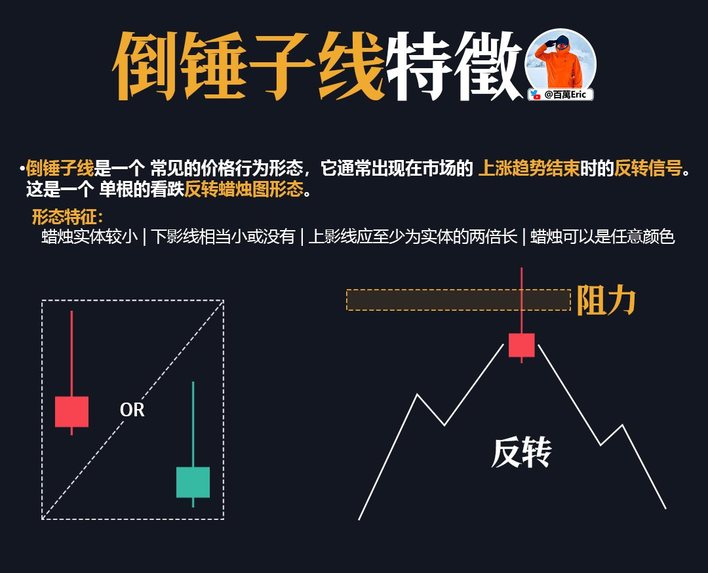

## 价格行为

价格行为的核心，在于观察多空力量在关键位置的表现。

图中多次出现长下影，说明每次价格下探到支撑区，买方都会在收盘前重新推高，把关键位置守了下来。

这其实反映了市场的真实博弈：支撑不是一条线，而是买盘反复介入、不断验证的区域。影线，就是买方力量的痕迹。

所以，判断价格行为，要看支撑是否被反复守住，买方是否在关键时刻积极介入。若答案成立，这个区域就具备参考价值。

---

## 反转K线形态

反转K线形态的价值，在于它们往往出现在关键位置，提示市场可能酝酿趋势转折。

例如，“阴吞没”常见于高位，说明卖方力量突然占优；而“锤子线”和“早晨之星”多出现在支撑区域，体现买盘在低位重新取得主动。

这些形态真正的意义，不在于单根K线本身，而在于结合位置和趋势去解读。

当它们叠加在关键阻力或支撑附近时，就从普通形态升级为有效信号。

最终，反转形态既是市场情绪的写照，也是交易计划中重要的入场与止损依据。

---

## 三重顶形态

三重顶是典型的顶部反转形态。价格在同一区域连续三次遇阻，说明上方阻力有效，同时也意味着买盘力量在逐渐减弱。

图中可以看到，阻力区反复压制，第三次冲高失败后价格回落，形态得到验证。

实盘操作时，入场点通常选择在第三次回落确认之际。止损要放在阻力区上方，以防假突破。

目标位则看形态下沿支撑，盈亏比往往能做到2:1甚至更好。

这种形态的价值，不在于“恰好三次高点”，而在于阻力反复确认，让进场与止损都有清晰的边界。
也就是说简单、傻瓜，止损清晰的交易机会。

---

## 支撑阻力的区别

在价格波动中，支撑与阻力并不是同等重要的。

主支撑和主阻力，往往来自更高周期或者大范围盘整区间的边界，它们对趋势的走向有决定性作用。

副支撑和副阻力，则更多出现在中途波动里，价格可能在其中多次反复，但一旦触及主级别，往往才会引发更强烈的趋势延续或反转。

从使用上看，主支撑和阻力是整体仓位管理的依据，决定交易的方向选择。副支撑和阻力则帮助优化进出场点位，提高盈亏比和交易节奏。

换句话说，主是骨架，副是细节，二者缺一不可。

---

## 支撑阻力互换

支撑阻力是交易里最基本的概念，但它不只是画一条水平线，而是在不同维度都有体现。

趋势线支撑，看的就是斜率。价格每次回踩趋势线都能稳住，就说明惯性还在，多头继续跟进。

均线支撑更像是动态的成本线，跟随价格波动。当价格回踩均线，往往就是买卖双方的分界。

支撑阻力互换，则是最直观的标记：阻力被突破，再回踩站稳，这里就变成了新的支撑。

这三种看似不同，其实是互补的。趋势线和均线提供节奏，支撑阻力互换明确关口，把它们结合起来，市场结构就更清晰。

---

## 等待回测

假突破是市场里最常见的陷阱之一。

价格冲破关键阻力，看起来要起飞，但很快掉头，追高的人瞬间被套。

我的习惯是，不会在第一根突破K线就进场，而是等回测确认。真正的突破，往往会（至少）回踩一次，把阻力变成新的支撑。支撑能守住，突破才算成立。

这样做的好处是，能避开绝大多数假突破。缺点也很现实：机会少了，有时候行情直接起飞，你只能看着。但这就是取舍。

所以，等待回测不是追求完美，而是为了更高的确定性。交易的关键，从来不是抓全，而是尽量少掉坑。

---

## 长下影线

长下影线，往往意味着一次下探失败。

空头把价格压到支撑下方，结果买盘立刻进来，把价格拉回去。影线本身，就是买方力量的痕迹。

更有意义的是，如果长下影不断在同一区域出现，那就不是偶然，而是稳定买盘在守。价格多次试探，却始终收不在支撑下方，这就是支撑被验证。

实盘里，看长下影要注意几点：

第一，它必须叠加在关键位置，单独一根没意义。

第二，看收盘价，而不是最低点。

第三，哪怕满足前两点，也只是低风险提示，不是稳赢信号，止损还是要放在影线低点之下。

说得更简单一点，长下影线反映的是一次多空力量的转换。读懂它，才能在市场恐慌中抓住那些相对安全的机会

---

## 斐波那契回调

斐波那契回调配合趋势，是一个挺实用的切入方法。

思路很简单：确定行情在走趋势，就别追在高点，而是等它回调，看关键比例位能不能撑住。

就拿图里的例子来说，价格在高位遇阻后往下走，刚好回到50%附近。重点不是数字有多神奇，而是它真的在这个位置企稳，把之前的阻力换成了支撑。

这个互换一旦确认，就给了一个低风险的上车机会。

具体要注意三点：

第一，前提是趋势方向要明确。没趋势的时候谈回调，更多是找死，不是找机会。

第二，别死盯比例。0.382、0.5、0.618 都只是参考，真正管用的是价格在那个位置的表现，能不能走出支撑阻力互换。

第三，止损一定要带。常见做法是放在0.618或者前低下方，一旦跌破，支撑就失效了，该走就走，别犹豫。

当然，不得不再次强调，斐波那契并不是预测未来的什么“神奇工具”，它只是帮你在趋势里挑出那些更顺手、更安全的切入点。

---

## 双顶

双顶之所以管用，是因为它反映了市场在高位的力量对比。

第一次冲顶没上去，说明压力在。第二次再冲还是没能突破，基本可以判断多头在高位的力量逐渐衰竭。。

做法上有几个关键：

先看颈线，只有跌破颈线才算真的双顶。跌穿那一刻，市场就从偏多彻底转为空。

然后看回测，通常跌破以后会反抽一下确认，完成支阻呼唤，这就是空单最舒服的切入点。

止损就很简单，放在第二顶上方或者跌破反弹测试区域，一旦被突破，说明形态不成立，得马上撤。

---

## 回调比例

入场没有唯一正确的点位，不同的回调深度，就是不同的选择。

38.2 的回调，适合想要提前上车的人。趋势强的时候，价格可能就只给这么浅的机会。不过止损很近，容易被洗掉。

61.8 是最常见的入场点，基本对应前一波走势的平衡区。盈亏比合理，也不至于太容易被震出。

78.6 更保守一些，等市场回得更深，确认支撑后再进，胜率高，但有时机会直接过去了。

88.6 就是极限低吸，通常要配合强支撑用。一旦错判，止损基本要设在113附近，亏损幅度会很大。

所以这些数字不是魔法，而是不同的思路。你想快，就浅一点；你要稳，就得多等一会。

关键是结合趋势背景，挑一个最合理的，而不是迷信参数。

---

## 支撑阻力

市场无论是上涨还是下跌，都会在一些区域停下来反复博弈。

支撑阻力，就是这样被市场的集体行为刻画出来的。

最简单的找法，寻找大时间级别价格形态的高低点。去看哪里出现过最多的互动——反复被压制、反复被拉起，这些地方就是关键的支撑和阻力。

它们的重要性，在于能提供两个最直接的参考：

第一，价格接近时，你可以提前计划，支撑附近考虑低吸，阻力附近考虑减仓或做空。

第二，一旦被有效突破，原本的阻力会变成新的支撑，反之亦然，这就是趋势的切换点。

最后，不得不强强调，压力和支撑是主观绘制的区域，而并非某个精准的点位，只需要追求模糊正确，不需要严丝合缝。

---

## 入场

入场不是随便找点，而是等市场自己给出方向的确认。

常见的切入，基本就三类：

第一，突破趋势线后回踩。原本压制价格的线被打破，再回踩踩稳，就是趋势反转的信号。止损可以放在回踩低点下方。

第二，更高的低点或健康回撤。这说明上涨途中只是整理，多头掌控局面。这类机会最舒服，顺势加仓，风险小、性价比高。

第三，支撑阻力的互换。价格跌破支撑反抽无力，支撑变成阻力，这是空头最干脆的入场逻辑，止损位置也非常清楚。

说到底，市场无非三种状态：反转、延续、失败。把握住这三类，就足以覆盖大多数入场场景

---

## 看跌形态

这六种“看跌形态”虽然外观各异，但核心逻辑是相通的：价格在高位遭遇阻力，多头动能持续衰竭，空头逐渐占据主导。

双顶和三重顶，是价格多次上攻无法突破的结果，反映出资金在顶部区域不断离场。

头肩顶形态中，颈线成为了关键的强弱分水岭，中间的顶点往往已是多头最后的努力。

扇贝形和杯柄形，则更多体现为长期盘整后动能的消退，价格高点趋于平缓，上涨力度减弱。

菱形整理，通常是市场经历剧烈波动后迎来方向选择，最终向下突破，表明空头完全掌控局面。

这些形态本质上都是多空力量转换在不同阶段的表现，共同指向一个结论：上涨行情可能即将结束。

---

## 吞没形态

吞没形态真正的意义，不在于单根K线长短，而在于买卖力量的交替。

连续下跌的阴线，本质上说明空头主导。但如果一根阳线能把前面的阴线全部覆盖，就代表市场在短时间内出现了力量反转。

当然，吞没形态并不是万能的。它的作用取决于发生的位置和成交量。如果在底部伴随放量，通常反转意义更强；如果出现在震荡区间里，那往往只是一次随机波动，或者说没有交易意义~

说得更简单一点，吞没形态看的是力量交替，而不是单图形好不好看。

---

## 均线

EMA均线是一种价格的动态平均，本质是把不同周期的价格数据压缩成趋势线。不同周期的均线，代表市场不同层级的资金认知和防守线。

5EMA和10EMA：最敏感的两条线，反映短期节奏。5EMA几乎紧贴价格，适合衡量即时趋势强弱；10EMA略慢，能过滤掉部分噪音，常被视作强动能行情的“节拍线”。当价格在这两条线上方连续运行，意味着短线强势。

20EMA：这是最常用的动态支撑/阻力线，属于中期平衡点。价格回踩20EMA后的表现，能快速区分强势趋势和普通趋势。如果行情属于真正的趋势市，回踩20EMA往往是二次上车的机会；一旦跌破20EMA且不能迅速收回，就要警惕趋势减弱。

50EMA：更长周期的趋势支撑/阻力，是趋势资金常用的参考。它不像20EMA那么灵敏，但一旦被有效跌破，意味着趋势进入更深度调整。

100EMA：处于50和200之间，常作为“中枢关口”。它本身并非所有交易者必看，但在长短周期资金的博弈中，100EMA会成为价格的临时平衡点。

200EMA：最后一道趋势防线。价格能否守住200EMA，往往决定趋势是否还算成立。跌破200EMA并持续下行，几乎可以视为中长期趋势被破坏。

交易策略上，均线不是预测工具，而是一个结构化的防守/进攻体系：短期EMA用于衡量节奏，中期EMA用于确认趋势延续，长期EMA则用于判断大趋势的生死。顺势操作时，EMA之间的“层层防守”能帮助规划止损和加仓点；逆势操作时，EMA则是潜在的阻力和风险警告。

---

## 支撑阻力互换

支撑阻力互换，是趋势运行中最常见的结构之一。

在下跌过程中，原本的支撑一旦被击穿，价格反弹回测时，往往会在同一位置遭遇压制，转化为新的阻力。

这一过程的核心是三步：支撑被打破，反弹受阻，低点不断下移。它反映了市场力量的转变，买方守不住，卖方逐渐占优。（逐渐是重点）

所以，支阻互换并不是价位的简单切换，而是趋势确认的重要环节。它标记了行情角色的转换，也给顺势入场提供了清晰的参考。

---

## 上升三角

上升三角是最常见的多头延续形态之一，它通常分为四个阶段：收敛 → 动能积累 → 压力被突破 → 多头趋势延续。

它的结构特征很直观：上方有一条明确的水平压力线，价格多次测试却迟迟未能突破；下方低点不断抬高，说明买方不再等待深度回调，而是在更高位置积极承接，导致三角区间逐渐收窄。

这种形态的本质是“多空力量的不对称”：空方依靠固定的压力位防守，但每一次防守都削弱了筹码；多方则通过逐步抬高低点不断逼迫空头后退。随着区间被压缩到临界点，价格突破的概率和力度明显提升。

理论说完，在实盘过程中的操作有2个关键点：

第一，突破确认要等到实体K线收在压力线上方，最好伴随成交量放大，避免假突破（不可能绝对避免，只能避开一些明显的假突破）。

第二，突破后走势往往直接加速，不太给回踩确认的机会，因此仓位策略要提前规划，一部分在突破时跟进，一部分等回踩再补。止损位置通常设在突破K线低点或三角下沿，一旦跌回区间内部说明形态失效。（也就是说，要提前规划好止损位置，以损订仓，一定要提前计算）

---

## 交易方法

突破交易，重点是市场脱离区间那一瞬间的能量释放。无论是箱体还是三角，边界被打穿，成交量和速度一起来，跟进去往往能吃到最直接的动能。但要小心假突破，光靠一根K线不够，最好等收盘确认，再看成交量有没有跟上。

顺势交易，更讲究耐心。方向走出来了，不用去赌突破，而是等市场自己回调。能稳在关键支撑或均线附近，就是顺势加仓的机会。胜率高，但切入点要拿捏准，止损必须卡在低点下方，否则被震荡洗掉很正常。错过就算了，别追。

反转交易，最考验交易基本功，尤其是细节手法。行情走到末端，关键位置被反复打测试（反复是关键），出现放量滞涨或者量价背离，这时候可以考虑小仓位去博反转。

为了方便各位靓仔理解，我再往简单了说：突破抓动能，顺势抓延续，反转博拐点。

市场处在什么阶段，就用什么方法，做到顺势而为。

---

## 盘整

被压在支撑与阻力之间反复震荡，多空暂时形成均衡。它既不是上涨趋势，也不是下跌趋势，而是市场消化前期波动、重新聚集能量的阶段。

真正有意义的是突破。当价格离开盘整区间，上破阻力意味着买盘胜出，行情进入新一轮上涨；下破支撑则说明卖压主导，市场转入新一轮下跌。突破往往伴随成交量放大和价格加速，这是因为市场预期在那一刻达成一致。

操作上要注意两点：第一，确认突破，最好是放量并连续收在区间外，避免被单根假突破骗进去；第二，顺应背景趋势判断方向，若大趋势向上，上破盘整更容易延续；反之在下跌趋势中，跌破盘整更具持续性。

简单来说，盘整阶段只有赚小钱机会。真正的交易价值在突破被确认的那一刻。假突破的问题客观存在。

---

## 收敛三角

收敛三角最大的意义，不在于形态本身，而在于它代表的市场状态：多空力量趋于均衡，波动逐渐收窄，价格被压缩在一个越来越小的空间里。

在这种过程中，市场并没有给出明确方向，既可能向上突破延续涨势，也可能向下跌破进入调整。换句话说，收敛三角不是趋势的终点，而是趋势的暂停，它提醒交易者“市场正在积蓄能量”。

落到操作层面，这类形态的关键点在突破。当价格接近三角末端，走势往往会被迫选择方向，一旦放量突破，行情的加速度往往比整理前更大。

难点在于突破真假：有时市场会出现短暂的假突破，再反向拉升或下跌。因此，交易者需要结合趋势背景来判断：若之前是强势上涨，三角更可能向上突破；若处在高位并伴随放量下跌，则下破的概率更大。

说得更简单一点，放个期望理解 ，收敛三角不是信号本身，而是能量压缩的过程，真正的交易机会出现在突破之后。

---

## 图形阅读
一个价格形态有没有意义，取决于它出现在什么位置。

不是图形决定结果，而是结构背景+动能分布决定下一步怎么走。

如果你在一段震荡中看到箱体、三角形、楔形，别急着动手。这类中性结构，本质上是筹码交换，是犹豫、是博弈，方向不明，动手就是对赌。

但如果你在一段强趋势中看到旗形、上升三角、下降楔形，那情况就变了。

这不是纠结，而是蓄势。多头换手、空头喘息，方向没变，只是暂缓推进。

这种时候出手，是顺势，是接力。

而当你在趋势末端看到头肩顶、双顶、上升楔形，这才值得警惕。

市场在交棒，主力在撤退，成交量在变化，趋势的惯性开始松动，反转正在酝酿。

所以真整的图形阅读能力绝对不是死记形态，形态是结构节奏的一部分，不是交易理由本身。

---

## 形态与趋势

这张图对比了趋势与形态的关系，核心是看突破方向与大趋势是否一致。

第一段是下降整理后的向上突破，属于反转型突破，虽然空间可观，但成功率需要更多确认，比如量能放大或关键支撑反弹。

第二段是上升趋势中的向上突破，方向与趋势一致，延续性最好，也是趋势交易者最喜欢的形态。

第三段是上涨后的向下跌破，提示趋势阶段性结束，需要考虑止盈或转向。

第四段是高位横盘中的假突破，表面突破，
实质无延续，这类形态在高位尤其要警惕。

第五段是上涨中的小整理后向上突破，回调浅、形态紧凑，延续上涨的概率较高。

最后也是最重要一点，判断突破是否值得参与，不能只看形态，还要结合趋势方向、突破位置、量能变化和市场环境，形成多维度确认。

---

## 布林通道

布林通道能做的事不止是“看上下轨”。
在震荡市里，上轨是超买区域（情绪过热），下轨是超卖区域（情绪过冷），反转概率高；但一旦波动放大，反转成功率会明显下降。

真正能拉开盈亏差距的，是在震荡策略中学会“放弃中间段”，只做接近上下轨的单子，并且看到中轨附近就果断止盈。

在趋势市里，布林收缩往往是资金观望到极致后的临界点。突破上轨或者下轨道，将出现趋势行情，并用布林中轨作动态止损。

换句话说，布林通道不是万能信号，而是帮你先判断“这是个该吃反弹的市场”还是“该顺势追的市场”，剩下的靠进出场细节把胜率推高。

---

## 锤子线

锤子线是一种常见的反转信号，通常出现在下跌趋势尾端或关键支撑位附近。

它的典型特征是：下影线很长，实体很短且靠近高位。这代表当天价格被强力砸下去后，买盘迅速接回，空头虽然一度占优，但最后被多头反包。

判断这根锤子线是否有参考价值，关键看三个方面：

1.下影线越长、占比越大，说明低位的买盘越坚决。

2.实体越靠近日内高点，表示多头主动拉升的意图越明显。

3.出现的位置要对：最好是趋势末端，或者接近重要支撑位，否则容易变成震荡中的假信号。

但要注意，锤子线不是进场信号本身。它只是一个市场态度转向的线索，是否进场还需要看后续是否出现有效确认，比如：次日放量阳线。成交量明显放大。高低点结构转折确立。

在震荡市中尤其要慎用，因为这种结构很容易频繁出现，最终被反复打脸。

---

## 斐波那契黄金口袋

斐波那契黄金口袋（0.618~0.65）是趋势行情中非常重要的回调观察区间。

它的意义不在于“数值神奇”，而在于这个深度：回调得够，但又没破坏趋势结构。

在强趋势中，行情通常不会轻易跌破这一区间，因此它常被视为低风险博弈趋势延续的位置。

使用方式很直接：明确趋势方向后，从起涨点到波段高点绘制回撤区间，观察价格是否回落至0.618~0.65之间。如果落入这个区间，且出现反转信号（如关键K线形态、放量上攻），可以考虑尝试顺势切入。

但需要强调的是，这个区间不是自动买入信号。它是否有效，取决于你有没有清晰的趋势背景。

如果行情本身已经进入震荡，或者趋势动能明显衰减，那么即使价格落入黄金口袋，也可能继续下探，甚至反转。

---

## 双底

别把所有W底都当一样看，双底也有形态分级

双底≠一个图形模板，背后是多种路径演化。看清细节，才能判断这个“底”到底靠不靠谱。

图中是4种典型的“双底形态”：

1.标准双底
两个低点接近，节奏对称，是最经典也最容易识别的双底结构。

2.弯曲型
第一波反弹比较弱，走势更弯，常见于大跌初期的情绪修复段，反包确认是关键。

3.左侧盘整型
第一脚底部横盘时间较长，意味着主力有耐心吸筹，突破后常见加速。

4.盘整双底
两脚都伴随横盘震荡，整个形态更像“震荡区底部”，一旦有效突破，后续走势更干净。

不论是哪种形态，颈线突破是交易触发点，突破后回踩不破颈线，是增加持仓信心的关键。

---

## 回调与反转

价格下跌，不一定是反转。真正的趋势变化，有明确的结构信号。

这张图就是一个经典例子：
左侧是上涨趋势，价格中途虽有多次下跌，但都只是回调，没破坏整体上升节奏；右侧才是真正的趋势反转，方向彻底改变，价格连续走低。

怎么区分回调和反转？

关键在下面三点结构判断：
1.是否打破趋势节奏？
回调下跌但仍保持“高点抬高、低点抬高”，说明趋势延续。一旦出现“高点降低、低点创新低”，才是趋势反转的开端。

2.是否跌破关键结构？
回调通常不会跌破前低或重要支撑。而反转则伴随着关键位失守，结构彻底破坏。

3.是否出现趋势线拐点？
回调阶段，趋势线支撑仍有效；
反转时，趋势线被明显跌穿，走势重新排列。价格下跌，不一定是反转。真正的趋势变化，有明确的结构信号。

---

## 均线与趋势

如何用一条EMA55均线，看穿趋势的真假反转？

EMA55在图中作为趋势分界，价格位于其下方代表空头占优，位于其上方代表多头占优。但趋势判断不止看均线，还要结合价格在均线附近的反应。

在下跌阶段，价格多次在EMA55下方承压，并伴随形态确认——如收敛三角的下破延续下行。

进入震荡箱体后，市场通过假跌破制造空头陷阱，随后反转向上。

反转过程中，价格在前高与EMA55双重阻力处出现两次回撤，但均未创新低，形成更高低点（HL）。

假跌破后的反包形态，叠加EMA55突破和连续阳线，确认趋势由空转多。

这套策略的关键是：EMA负责定义趋势基调，价格行为验证趋势的真实性和转折信号。

---

## 多周期
同样的K线，不同的路径，不同的应对策略！！！

K线是对一段时间内价格波动的压缩记录，走势则是那段时间的价格轨迹。

上图的4H×2和4H×3分别表示，将4小时K线放大到更小级别（例如15分钟）后，你能看到它内部的价格波动细节。

相同的K线组合，在更小周期上可能呈现完全不同的路径结构，有的中间经历了急跌反弹，有的则是震荡爬升。

理解这一点的作用在于：不能只看K线形态，就假定内部结构一致！！同样的收盘价和影线，背后可能是截然不同的多空力量过程。这也是多周期分析的核心——用小周期确认大周期的走势质量。

---

## 均线交叉

均线交叉信号主要依赖两条不同周期的EMA（这里是EMA50与EMA200）来判断趋势方向。

金叉出现时，短周期均线从下方突破长周期均线，意味着短期走势转强，通常被视为趋势转多的信号；死叉则相反，短周期均线从上方跌破长周期均线，提示趋势转弱，偏向做空。

但交叉信号并不是即刻入场的理由，因为交叉本质上是对过去价格的反映，往往在一段走势已经启动后才出现确认。

更有效的用法是，将交叉作为趋势方向的辅助依据，再结合形态、支撑阻力或量能确认入场位置，这样可以降低信号延迟带来的风险。

此外，均线周期设置并非固定，EMA50与EMA200的组合适合中期趋势判断，若做短线，可以使用更短的周期组合，但要承受更多噪音。

---

## 缺口

跳空是价格在开盘瞬间直接跨越上一根K线的收盘价，形成没有交易记录的价差区间。它出现的原因，往往是隔夜信息、盘前交易或情绪集中爆发，导致买卖力量瞬间失衡。

实盘里，向上跳空通常出现在趋势加速段、重大利好兑现或关键阻力位被直接突破时。如果缺口上方迅速站稳并放量，意味着趋势有延续潜力；若很快回补，说明突破缺乏跟进力量，反而可能形成反转信号。

向下跳空多伴随恐慌性抛售、重大利空或支撑位被直接击穿。缺口若持续存在，是空头趋势延续的确认；若短期被完全回补，则可能是恐慌过度的修复行情。

无论多空，缺口的上下沿都是重要的交易分界线。做多时，缺口上沿是止损防线；做空时，缺口下沿是风险控制点。追单要谨慎避免在缺口中间位置盲目进场，因为这是成交真空区，价格波动容易失控。

---

## K线形态

不同的K线形态，本质是市场在不同阶段的能量积累与释放方式。

牛市旗形、三角旗、上升三角、对称三角，都属于趋势延续形态，价格在调整区间内蓄力，突破方向多为原趋势方向，入场点通常在突破并收稳的K线后；

杯柄形态、双底、上升谷底，则是反转型结构，特点是底部多次确认，突破颈线后往往迎来加速上涨；

量度涨幅是针对突破后的测算方法，利用前一段的涨幅估算目标位；

上升扇形代表趋势中的缓步加速，但加速到一定程度要防范高位反转；

每个形态的关键，是识别有效突破与假突破，配合止损位控制风险。形态不是预测工具，而是交易决策的结构依据。

---

## 上升趋势的识别

上升趋势的识别关键，是价格不断刷新更高的高点（HH）与更高的低点（HL）。

在走势中，首先找到显著的高点和低点位置，这些位置往往伴随价格的转折或波动幅度的扩大。

随后观察每一次回调后的低点是否高于前一低点、每一次拉升后的高点是否突破前高。

HH与HL的交替出现，代表多头持续占据主导，即使中间有回调，也没有破坏趋势结构。

若出现高点无法突破、低点跌破前低的情况，就要警惕趋势可能减弱或反转。

因此，判断上升趋势不仅是看价格往上走，更是确认结构的连贯性和主导力量的稳定性。

---

## 趋势的本质

判断上升趋势，核心不是那条趋势线画得多直，而是价格结构是否持续维持“更高的高点（HH）+更高的低点（HL）”。

趋势线被短暂刺破，只要这个节奏没被破坏，多头的主导权就还在。

真正的趋势反转，往往是高点不再创新高、低点被有效跌破，同时成交量和动能也明显偏向空方，这种结构性的变化，才是趋势切换的信号，而不是单根跌破趋势线的K线。

---

## 形态的本质

到底应该如何理解价格形态？

对有经验的交易员来说，形态只是观察市场的一个窗口，不是必须死守的铁规。楔形、三角形、通道，这些名字只是标签，它们的意义在于揭示背后的供需变化，而不是形状画得有多标准。

真实的盘面从不照着教材走。影线会偶尔扎出形态之外，支撑阻力可能被短暂击穿，波峰和波谷也未必对称。很多时候，这些“瑕疵”并不意味着结构失效，而只是市场在呼吸。

关键是你能不能透过这些细节，判断多空力量的转移是否仍在按原方向推进。理解了这一点，你就不会因为形态“不完美”而错过机会；反之，死守几何标准，往往会让你在混乱的行情里变得束手束脚。真正的底气，来自看懂本质，再做选择。

具体形态会骗人，总体结构不会。

---

## 斐波那契回撤

斐波那契回撤常用于衡量趋势中的调整幅度，帮助判断支撑与潜在反转位置。

使用时，先确定本轮走势的低点与高点，形成计算区间。比例越接近 0%，说明价格离高点越近；比例越接近 100%，说明回撤幅度越深。

常用的关键水平有 61.8%、78.6%、88.6%。

61.8% 是常见的强趋势回撤位，趋势若有延续，多在此区域获得支撑；78.6% 和 88.6% 属于深度回撤，更接近反转或趋势衰竭的临界点。

这些比例并非孤立使用，通常需要结合形态、成交量或关键均线来确认有效性。

单独依赖比例容易出现“刚到位就破位”的假信号，因此它更适合作为位置参考，而不是唯一的进出场依据。

---

## 位置

看K线，先定位置。它是在趋势的延续中，还是关键支撑/阻力附近？

这是所有解读的前提。位置不同，同样的形态可能完全相反的意义。

确定位置后，再看影线与实体。长下影多出现在低位承接，长上影则常见于高位抛压；

但如果出现在中途震荡区，就可能只是日内波动，并不具备反转价值。

实体大小补充了力度的判断—大实体配合突破说明力量集中，小实体伴随长影则意味着犹豫。

最后结合周期衡量信号的分量。

日线级别的反转K线能改变趋势预期，5分钟级别的相同形态更适合做短线的进出场。

位置、形态、周期，这三者缺一不可。

---

## 倒锤子线

倒锤子线的关键，不是影线长短本身，而是它出现的位置。

它代表在价格冲击阻力位的过程中，买方推进受阻，被卖方迅速反压，收盘留在实体下方。

信号可靠的条件有两个：

1.必须出现在明确的阻力区，而不是趋势中途。

2.次日若价格跌破倒锤子线的最低点，才算触发反转确认。

最后也是最重要但极容易让人迷惑的一点：倒锤子线不是反转的原因，它只是市场拒绝继续上涨的迹象，位置和后续确认才是决定胜率的核心。

---

## 下跌楔形

下跌楔形，并不是因为形态本身看多，而是因为价格在持续收敛中，卖方力量逐步衰减。

当每一次新低都被快速收回，并且阻力线被突破时，意味着趋势方向有机会反转。

真正的入场优势在于：突破后的第一次回踩支撑，能确认买方接力是否成立。

若回踩企稳，盈亏比自然被拉高，因为止损点与突破位置接近，而利润空间仍按楔形量度目标测算。

---

## 多指标确认

多指标确认的意义在于减少单一信号的误判率或者说降低“主观”拟合。

这张图中，双底形态先确立了结构上的反转可能。

紧接着，EMA10与EMA20形成金叉，验证短期趋势已经由空转多。

随后，价格在均线之间的“买入区域”连续获得支撑，说明资金进场的节奏稳定且持续。
这种组合信号的优势在于形态提供方向假设，均线金叉给出趋势确认，价格在支撑区的反应则提供入场时机。

三者同向时，胜率与持仓信心都会显著提升。

---

## 斐波那契回撤

斐波那契回撤位的核心价值，不是预测价格一定会在某个百分比反弹，而是提供一个机构和交易者普遍参考的潜在支撑区域。

50%、61.8%、78.6 这三个位置的意义在于：回撤越深，趋势被破坏的可能越大，参与者心理压力越高。

50%是常规调整，趋势健康；61.8%是黄金分割，往往是资金大幅吸筹的区间；78.6%属于极限回撤，如果这里还能企稳反弹，说明底部资金承接极强。

真正的用法是，把这些比例与结构支撑、K线形态、成交量信号叠加，锁定市场最可能的反转区间，而不是单纯等数字对位。

---

## 顶底背离

顶底背离的价值，不在于它本身，而在于它发生的位置和伴随的市场结构变化。

这张图的背离出现在连续下跌后的低位，价格创新低，而RSI低点却抬高，这是卖盘衰竭的典型信号。

关键在于，背离发生时价格刚好触碰支撑区，并伴随趋势线突破和反转K线，这让信号从“可能”变成“概率极高”。

在实际交易中，这类信号并不是每次都进，而是等“背离+结构拐点+确认K线”三者重合时再出手，是高胜率“赌一把”的机会。

---

## 顺势回调

顺势回调交易的核心，是在趋势已经成立的前提下，找位置和信号，让切入风险更小、容错更高。

支阻互换，是突破前高后回踩确认支撑，踩稳说明买盘愿意在更高位置接力。

斐波那契0.618，是顺势多头最后的防守位置，十字星出现在这里，说明空头试探失败，多头重新占优。

EMA均线回踩，价格回踩关键均线，测试不破，就是顺势跟进的条件之一。

无论是哪一种，最主要的都是先趋势先定方向，否则实战效果大打折扣。

---

## K线强弱

判断一根K线的强弱，不是看它涨了多少，而是看它收在哪、影线长短、以及和前面K线的位置关系。

如果收盘价高于前两根K线且没有上影线，说明多头在整段波动里占据绝对主动，强度最高。

如果收盘价高于上一根K线但伴随明显上影线，表示多头曾经发力但被空方部分压制，力量一般。

而当收盘价低于上一根K线并且出现长上影线，就意味着多空的攻势被空方完全反制，市场短期已转向空方掌控。

---

## 趋势反转

真正有价值的突破，往往不是第一次尝试就成功，而是价格在关键位置下方反复蓄势后，再一举突破。

这张图里，价格并没有马上冲击压力区域，而是先在下方区域不断横盘，每一次试探、都像是在“敲门”，同时也不断向市场释放一个信号：这个阻力位非常关键。

只要蓄势足够充分，基本面和情绪没有走坏—那就不需要多大的催化剂，哪怕只是一个小利好，足以点燃行情。

最终，市场会用一个加速动作表明：确认完成，方向成立。

---

## 结构共振

真正的好入场，是结构共振的结果，不是图形好看。

趋势线抬升 → 前高突破 → 回踩确认 → 锤子线反包。

四重结构拼出一个完整反弹逻辑。

这时候入场，盈亏比极好，错也只错一次。

---

## 吞没形态

并不是所有的 #吞没形态 都值得交易，真正高胜率的结构，往往出现在一轮加速趋势的尽头。

图中的下跌是典型的加速下行节奏，连续阴线、波动加大，直到最后一根放量长阴才触发反向反击。

这个位置出现的吞没形态，背后包含的是多头筹码大幅介入 + 空头动能耗尽，因此更容易成为节奏反转的触发点。

判断一个形态是否有效，不是看它长得标准不标准，而是看它背后的节奏是否具备“转折”的条件。

---

##

很多人理解错了“诱多诱空”的判断方式，总以为只要突破了高点或低点、然后又跌回去，就是诱多或诱空。

其实，这只是“假突破”，还不构成“诱多/诱空”。

真正的诱多，是指：

突破位置（如前高）确实引发了很多人追多进场，但价格很快掉头下杀，把这些追多资金“套住”甚至打爆。

诱多/诱空＝诱导建仓 + 迅速画门

进一步来说，这个“诱”的动作是否真的引发了大量交易行为，而后价格又迅速反打造成损失。

因此判断时，不能只看“破没破位置”，而要观察：

价格在关键为止是否存在：引诱+反杀。

如果只是冲高失败然后震荡，那不叫诱多；如果是冲高后立即反向打穿前低，那才是假突破。

---

## 斐波那契回撤线

斐波那契回撤线在技术分析里常被赋予“神奇支撑/阻力”的意义，比如0.618、0.382这些常见数值。

但它并不是预测魔法，而是帮你理解：行情在剧烈波动后，有多大概率会“回头看一眼”。

图中这波走势呈现出：

1.从下跌低点到反弹高点，完成一轮上涨；
2.回调过程中，价格在0.618附近震荡止跌，酝酿新一轮上攻。

为什么0.618能“止住”？
因为它不是某个精确价格，而是大多数交易者情绪松动的位置：

前面追涨的在这亏得刚刚好，砍不砍？想反手的看到这里跌得差不多了，要不要博一把？

所有回撤点位本质上，都是参与者重新评估仓位与预期的“心理锚”。

---

## 跌破支撑

多数人看到支撑跌破，会直接做空，但真正能走得下去的行情，并不是因为“破了”，而是破了之后还能守得住，甚至被市场重新接受为新的结构基准。

图中展示了四种经典的结构变体：

第一类是跌破后弱反弹，连支撑都回不去，说明情绪完全倾向空头，是顺势入场的机会；

第二类虽然反弹，但收出长上影下跌K线，表明上方抛压依旧存在，入场点更晚但确认更强；

第三类是回到支撑区反弹，等于“踩确认”，买方有明显反制动作，适合博反转；

第四类看似跌破，其实是假破+反包，重新站上原支撑并突破压力位，是节奏转强的信号。

跌破不是信号，后续怎么走才是。

结构要么顺势延续、要么快速反弹，而真正的入场机会，都藏在这个破位之后的二次动作里。

---

## 形态的本质

图形不会给人带来胜率，但会给人带来预期。

这些常见的线型形态，从头肩顶、双底到旗形和收敛，不是用来预测行情，而是用来判断结构是否完成、节奏是否到位、波动是否释放。

比如头肩底、双底等反转形态，本质上是一个“下跌→反抽→回踩不破”的确认结构。

你看到的并不是图形本身，而是市场在筑底过程中留下的节奏线索。如果反抽不成立，或者回踩跌破颈线，这个结构就失效。

旗形、楔形、收敛结构，则更多出现在趋势中继段。它们的作用是帮助我们识别：“当前是否只是整理，而不是反转？”

如果价格在整理段中没有跌破趋势支撑线，且依然保持结构完整，那么就有望延续方向，走出下一段主升或主跌。

形态只能作为结构框架参考，不能作为入场理由本身。

---

## 入场

别在“突破那一刻”冲动进场。

更可靠的操作手法：突破 → 回踩 → 守住关键位 → 再进。

确认要点（至少满足其一）：

1.回踩到前高/颈线/趋势线/平台边界；

2.回踩后收回关键位之上（以收盘价为准）；

3.回踩期间量能/波动未显著放大（避免情绪化假突破）。

入场与风控：

入场：回踩确认后介入；

失效：跌回关键位下并收盘确认；

止损：放在确认K线低点或最近结构低点下；

止盈：先看结构量度/最近阻力，沿“更高的低点”抬止损。

最后也是最重要最容易迷惑人的一点：真正的交易入场点，往往在突破之后，而不是突破本身。

---

##

